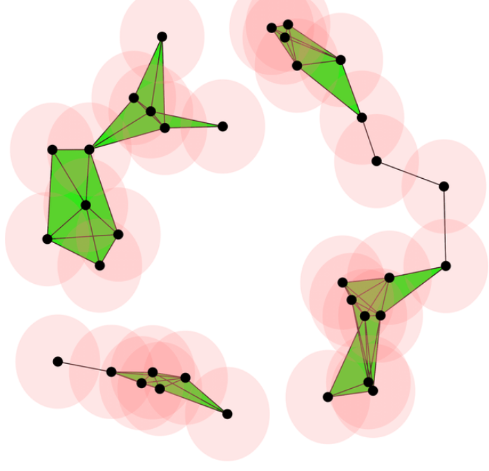

# Ball mapper

## The Vietoris-Rips complex

Another way to reduce the complexity of a metric space is to approximate it by a [simplicial complex](https://en.wikipedia.org/wiki/Simplicial_complex). Simplicial complexes are like small building blocks glued together: points, line segments, triangles, tetrahedra, and their higher-dimensional analogues.

The [Vietoris-Rips complex](https://en.wikipedia.org/wiki/Vietoris%E2%80%93Rips_complex) is defined from a metric space $(X, d)$ and a scale $\epsilon > 0$ by

$$
VR(X, \epsilon) = \{ [x_1, \ldots, x_n] \; ; \; d(x_i, x_j) < \epsilon \text{ for all } i,j \}.
$$

So the vertices are the points of $X$, and we add a simplex whenever all of its vertices are pairwise close enough. This is one of the most common ways to turn a metric space into a combinatorial object.



## The ball mapper

Ball Mapper is clearly inspired by the Vietoris-Rips complex, but it restricts the centers of the balls to a chosen subset of landmark points. Given a metric space $(X, d)$, a subset of indices $L \subseteq \{1, \ldots, n\}$, and a radius $\epsilon$, we place an $\epsilon$-ball around each landmark and connect two landmarks when their balls overlap.

In that sense, Ball Mapper can be viewed as a landmark-based simplification of the 1-skeleton of a Rips-like construction: it keeps the large-scale geometry while using far fewer centers than the full dataset.

## Example in Julia

```{julia}
using CairoMakie
using MetricSpaces
using MetricSpaces.Datasets
using TDAplots
using Random
```

To exemplify, consider a circle:

```{julia}
X = sphere(1000, dim = 2)
metricspace_plot(X, markersize = 4)
```

Now choose 100 landmarks with farthest-point sampling and build the Ball Mapper graph:

```{julia}
L = farthest_points_sample_ids(X, 100)
bm = ball_mapper(X, L, 0.35)
```

```{julia}
mapper_plot(bm, node_values = node_colors(bm, first.(X)))
```

The resulting graph is a combinatorial shadow of the circle: it keeps the loop, but with far fewer nodes than the original point cloud. That is the point of Ball Mapper: summarize shape without carrying every point around.

## Remarks

- The landmark set $L$ controls the resolution.
- The radius $\epsilon$ controls how much overlap we allow between neighboring balls.
- If $\epsilon$ is too small, the graph becomes disconnected.
- If $\epsilon$ is too large, the graph collapses and loses shape information.

Ball Mapper is especially useful when the raw point cloud is large, because it compresses the dataset before building the graph.
