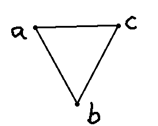
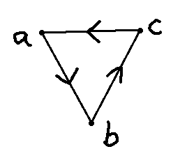

# Simplicial homology

> "Her thoughts were theorems, her words a problem, \
> As if she deem'd that mystery would ennoble 'em." \
> --- Lord Byron, in "Don Juan"

Simplicial complexes are excellent tools to model finite spaces. But how do we extract topological information from them? How do we *count the holes*?

This is what homology does. It is one of the most powerful invariants in topology: a functor that transforms topological spaces into algebraic objects (groups, vector spaces) that we can compute with. In this chapter, we will build it step by step using simplicial complexes.

## What is a hole?

How can we detect a hole in a simplicial complex? Intuitively, a hole is something *that is not there*. A circle has a 1-dimensional hole (a loop with no filling). A hollow sphere has a 2-dimensional hole (a surface enclosing empty space). A solid ball has no holes at all.

Let's reason using the following simplicial complex $S$ (with vertex set $V = \{a, b, c\}$) as an example:

This complex has three vertices ($a, b, c$) and three edges ($[a,b], [b,c], [c,a]$) but no 2-simplex (no filled triangle). Topologically, it looks like a circle — and a circle has a hole!

## Orientation and the boundary operator

Let's add a direction (orientation) to the 1-simplices of $S$:

Intuitively, a 1-dimensional hole is formed when we have a sequence of edges that closes on itself, like a snake biting its own tail. It would be nice if we could detect these *cycles* in a formal manner... Luckily for us, [Poincaré was a very smart guy](https://en.wikipedia.org/wiki/Analysis_Situs_(paper)).

To describe a segment in a vector space, we need only two points: the beginning $u$ and the end $v$. This vector can be written as $v - u$. Inspired by this, we define a function $\partial$ called the *boundary operator* on the edges of $S$ by

$$
\partial_1([x, y]) = y - x.
$$

But what is the meaning of $a - b$? This is just a "formal sum": we treat $a, b, c$ as a basis of a vector space. This vector space is called a [free abelian group](https://en.wikipedia.org/wiki/Free_abelian_group) on $V$. Its elements are formal linear combinations like $2a - b + 3c$.

## Chain complexes

Let's organize this properly. For each dimension $k$, we define:

::: {#def-}
The *$k$-th chain group* $C_k(S)$ is the free abelian group generated by the $k$-simplices of $S$. Its elements (called *$k$-chains*) are formal linear combinations of $k$-simplices with integer coefficients.
:::

For our triangle example:

- $C_0(S)$ is generated by $\{a, b, c\}$ — formal sums of vertices
- $C_1(S)$ is generated by $\{[a,b], [b,c], [c,a]\}$ — formal sums of edges
- $C_2(S) = 0$ — there are no 2-simplices (no filled triangle)

We extend $\partial$ linearly to all chains. We also impose that $[a, b] = -[b, a]$ (this makes the orientation consistent). The *boundary operator* for a $k$-simplex $[v_0, v_1, \ldots, v_k]$ is defined as:

$$
\partial_k([v_0, v_1, \ldots, v_k]) = \sum_{i=0}^{k} (-1)^i [v_0, \ldots, \hat{v}_i, \ldots, v_k]
$$

where $\hat{v}_i$ means "remove $v_i$". For example:

- $\partial_1([a, b]) = b - a$ (delete first vertex, then delete second with a sign change)
- $\partial_2([a, b, c]) = [b, c] - [a, c] + [a, b] = [a, b] + [b, c] + [c, a]$ (the boundary of a filled triangle is its three edges)

## Cycles and boundaries

Now, let's compute $\partial_1$ on the sum of all edges of our circle-like complex:

$$
\partial_1([a, b] + [b, c] + [c, a]) = (b - a) + (c - b) + (a - c) = 0.
$$

The boundary is zero! This makes geometric sense: if you walk along all three edges, you return to where you started — there is no "boundary" left over. This is a *cycle*.

::: {#def-}
A $k$-chain $\sigma$ is called a *$k$-cycle* if $\partial_k(\sigma) = 0$. The set of all $k$-cycles is denoted $Z_k = \ker(\partial_k)$.
:::

::: {#def-}
A $k$-chain $\sigma$ is called a *$k$-boundary* if there exists a $(k+1)$-chain $\tau$ such that $\partial_{k+1}(\tau) = \sigma$. The set of all $k$-boundaries is denoted $B_k = \text{im}(\partial_{k+1})$.
:::

A key algebraic fact is that **every boundary is a cycle**:

$$
\partial_k \circ \partial_{k+1} = 0.
$$

This means $B_k \subseteq Z_k$. You can verify this with the filled triangle $[a,b,c]$: its boundary $\partial_2([a,b,c]) = [a,b] + [b,c] + [c,a]$ is indeed a cycle (as we computed above).

## Homology: the punchline

Now we arrive at the key idea. Both cycles and boundaries are "things with zero boundary." But a boundary is a cycle that is *trivially* zero — it bounds a higher-dimensional simplex. A *hole* is a cycle that is **not** a boundary. It closes on itself, but there is nothing filling it in.

::: {#def-}
The *$k$-th homology group* of a simplicial complex $S$ is 

$$
H_k(S) = Z_k / B_k = \ker(\partial_k) / \text{im}(\partial_{k+1}).
$$

The $k$-th *Betti number* $\beta_k$ is the rank of $H_k(S)$.
:::

The Betti numbers count the topological features of each dimension:

| Betti number | Counts |
|---|---|
| $\beta_0$ | Connected components |
| $\beta_1$ | 1-dimensional holes (loops) |
| $\beta_2$ | 2-dimensional holes (cavities) |
| $\beta_k$ | $k$-dimensional holes |

### Example: the triangle without filling

For our complex $S$ with vertices $\{a, b, c\}$ and edges $\{[a,b], [b,c], [c,a]\}$ but no 2-simplex:

- $H_0(S)$: The complex is connected (you can walk from any vertex to any other), so $\beta_0 = 1$.
- $H_1(S)$: The cycle $[a,b] + [b,c] + [c,a]$ is not a boundary (since $C_2 = 0$, there are no boundaries at all!). So $\beta_1 = 1$ — there is one loop.
- $H_k(S) = 0$ for $k \geq 2$.

### Example: the filled triangle

Now suppose we add the 2-simplex $[a,b,c]$ (filling in the triangle). Then $\partial_2([a,b,c]) = [a,b] + [b,c] + [c,a]$, which means the cycle from before is now a boundary. The hole is filled! So $\beta_1 = 0$.

### Example: the sphere

A simplicial sphere (the surface of a tetrahedron, for instance) has $\beta_0 = 1$ (connected), $\beta_1 = 0$ (no loops), and $\beta_2 = 1$ (one cavity — the hollow inside). 

## Why homology matters for data

Homology is a topological invariant: if two spaces are homeomorphic, they have the same homology groups. Conversely, if two spaces have different Betti numbers, they cannot be homeomorphic. This is the "simplification map" $H$ we alluded to in the topology chapter — it reduces a complex topological space to a sequence of numbers.

Moreover, homology is *computable*. Given a simplicial complex (which is just a list of sets), we can write the boundary operators as matrices and compute their kernels and images using linear algebra. This makes homology a perfect tool for data analysis: build a simplicial complex from data, compute its homology, and learn about the "shape" of the data.

The next question is: at which scale should we build the simplicial complex? We will answer this in the chapter on persistent homology, where we build complexes at *every* scale and track how features appear and disappear.