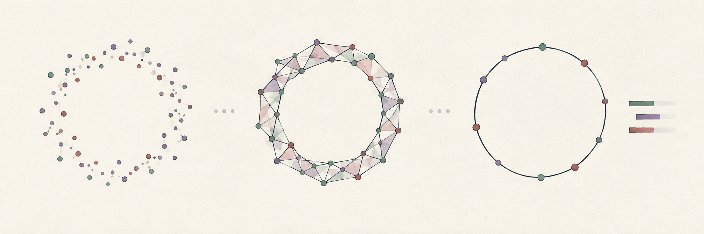

{.chapter-opener width=100% fig-alt="Decorative illustration of a ring-shaped point cloud, a triangulated ring with an open center, and a loop beside persistence-inspired bars."}

> "Who cared? Why should it matter to anyone how I had filled my poor brain those ten years?" \
> --- Stanisław Lem, in *Return from the Stars*

## Why Topological Data Analysis?

Topological data analysis is an exotic animal.

How can one mix a field from abstract mathematics with real-world data? A cloud of finitely many distinct points, with its usual subspace topology, is discrete: every point sits alone, and there is no continuous loop to find. Finite topological spaces in general can be surprisingly rich; the problem here is specifically that a discrete cloud does not directly represent the shape we think it samples.

To connect the two, we use distances to build a family of geometric objects. Nearby observations become connected; triangles and higher-dimensional pieces fill in as the scale grows. We can then ask which components, loops, and cavities appear, and how long they survive.

Imagine points sampled around a circle. The mean lies near the empty center, and coordinate-wise variances do not describe the hole. A graph connecting nearby points may reveal the loop. At a much larger scale, the hole fills in. Persistent homology records that changing picture. It complements statistical and geometric methods; whether it helps with a particular scientific question must be checked.

### What information do the methods use?

For a distance-based filtration, translating, rotating, or reflecting a Euclidean cloud preserves all distances and its persistence diagrams. Changing units, rescaling one coordinate, or replacing the metric can change them. For an image filtration, the chosen pixel values and spatial adjacency play that role.

A filtration studies a range of scales, but we still choose the data representation, metric, filtration, and computational cutoff. A long interval can be useful evidence of structure at those scales. It is not automatically statistically significant, and a short interval can be meaningful at a finer scale. The [uncertainty chapter](uncertainty.qmd) will make that distinction concrete.

Stability theorems bound diagram changes under particular input perturbations [@stability; @ripsstability]. Their hypotheses matter. They do not promise immunity to outliers or to changes in how the observations were collected.

The definitions work in many dimensions. The computational cost may not: the number of simplices can grow very quickly. We will use small examples whose results we can inspect before attempting larger ones.

## How to read this book

You need basic familiarity with vectors, matrices, functions, and Julia arrays. Some linear algebra helps in the homology chapter; we work through the necessary finite-field matrix calculation rather than assuming that algebraic topology is already an old friend.

The book follows five main instructional parts, followed by paper reproductions and closing material:

1. **Topology:** spaces, simplicial complexes, and homology. Four corners of a square provide a running example from edges to boundary matrices.
2. **Working with data:** point clouds, preprocessing, distances, density estimates, and classical clustering.
3. **Persistent homology:** filtrations, barcodes, diagrams, Julia computations, and the distinction between stability, sampling variation, and statistical evidence.
4. **TDA methods:** ToMATo, Mapper, Ball Mapper, and the covers and nerves behind them.
5. **Applications:** benchmark clustering, handwritten digits, delay embeddings, and shape comparison, including sensitivity checks and examples that do not recover everything we hoped for.

Each mathematical chapter starts with intuition, then specifies what we are calculating. Try the prediction exercises before opening their worked answers. They ask you to explain a result, not merely copy a command.

For a first computational pass, run the quick start below, then read [point clouds](pointclouds.qmd) and [computing persistence](computing_ph.qmd). When the notation starts looking like a collection of insects, return to the square in [simplicial complexes](simplicial.qmd), [homology](homology.qmd), and [persistence](persistence.qmd). The applications link back to the definitions they use.

## Setting up Julia

This edition was checked with **Julia 1.12.5**. Its project requires Julia 1.12 or later; later versions may need their own validation. From the book directory, run:

```sh
julia scripts/setup.jl
julia --project=.
```

The setup script installs the pinned environment and extracts the six JuliaTDA packages included with the book. You do not need the author's sibling repositories. The [environment notes](environment/README.md) explain the source snapshot, downloads, and development setup.

To rebuild the HTML book, also install Quarto and Python with Jupyter, then run:

```sh
quarto render --cache-refresh
```

Setup registers the `tda-book` Julia kernel used by Quarto. The first installation compiles dependencies; the digit chapter downloads MNIST on its first run. Its defaults use a small training subset so that the complete experiment is practical on a CPU. Timings include a separate discussion of compilation and data preparation.

This book teaches TDA rather than Julia itself. For language fundamentals, see [Think Julia](https://benlauwens.github.io/ThinkJulia.jl/latest/book.html) or [Julia for Optimization and Learning](https://juliateachingctu.github.io/Julia-for-Optimization-and-Learning/dev/).

## A first computation

Let us make a circle before we define all the machinery. We use 40 equally spaced points, connect points according to their distance, and ask for components ($H_0$) and loops ($H_1$).

```{julia}
#| label: intro-quick-start
using CairoMakie, MetricSpaces, TDARipserer, TDAPersistenceDiagrams, TDAplots

theta = range(0, 2pi, length = 41)[1:end-1]
M = permutedims(hcat(cos.(theta), sin.(theta)))
X = EuclideanSpace(M)
diagrams = ripserer(Rips(X), dim_max = 1)

finite_loops = [interval for interval in diagrams[2] if isfinite(interval)]
println("Finite loop intervals: ", length(finite_loops))
println("Longest loop lifetime: ", round(maximum(persistence, finite_loops), digits = 3))
```

```{julia}
#| label: fig-intro-circle
#| fig-cap: "Forty points on a unit circle and their persistence diagrams. In H₁, the point far from the diagonal records a loop that survives over a range of connection distances; it is not a point in the original cloud."
fig = Figure(size = (850, 350))
ax = Axis(fig[1, 1], title = "Input cloud", aspect = DataAspect(),
          xlabel = "x", ylabel = "y")
scatter!(ax, M[1, :], M[2, :], markersize = 6)
ax2 = Axis(fig[1, 2], title = "Persistence diagrams", aspect = DataAspect(),
           xlabel = "Birth (edge length)", ylabel = "Death (edge length)")
lines!(ax2, [0, 2.1], [0, 2.1], color = :gray)
for (j, diagram) in enumerate(diagrams)
    scatter!(ax2, birth.(diagram),
             [isfinite(bar) ? death(bar) : 2.1 for bar in diagram],
             label = "H$(j - 1)", markersize = 7)
end
hlines!(ax2, [2.1], color = :gray, linestyle = :dash)
text!(ax2, 0.3, 2.1, text = "∞ (essential H₀)", align = (:left, :top))
axislegend(ax2, position = :rb)
fig
```

In the left panel, each dot is an observation in the plane. In the right panel, each dot represents an interval, with a birth on the horizontal axis and a death on the vertical axis. A loop born at $b$ and filled at $d$ has lifetime $d-b$. Its location in this diagram does not tell us where the loop lies in the cloud. The 39 short $H_0$ intervals have almost identical coordinates here, so their points overlap. The dashed line displays the essential component at a convenient height; it does not give it a finite death. We will unpack every step of this computation in Part III.

## Conventions

A point cloud is usually a `EuclideanSpace` from `MetricSpaces.jl`. In a $p \times n$ input matrix, each **column is one observation**, and each row is one coordinate. Use `as_matrix(X)` to recover a matrix for plotting.

Unless a chapter says otherwise, persistent homology uses coefficients in the field $\mathbb F_2$. We distinguish geometric coordinates, filtration parameters, and diagram coordinates throughout. Rips uses a maximum **edge length** parameter; Čech balls and the alpha filtration have their own scale conventions, which we explain when comparing them.

## Exercises

### 1. The point at the center

Why does the mean of the sampled circle not count as an observation? Does moving the cloud change its Rips diagram?

::: {.callout-note collapse="true" title="Worked answer"}
The mean is a summary computed from the observations; it need not be among them. Translating the cloud preserves all pairwise distances, so it preserves this distance-based filtration and its persistence diagram.
:::

### 2. Coordinates in two different plots

What does a point near $(0.16, 1.78)$ in an $H_1$ persistence diagram represent? Is it a point at those coordinates in the original plane?

::: {.callout-note collapse="true" title="Worked answer"}
It represents a loop interval born around scale $0.16$ and dying around scale $1.78$. Its lifetime is about $1.62$. These are filtration coordinates, not spatial coordinates of an observation.
:::
