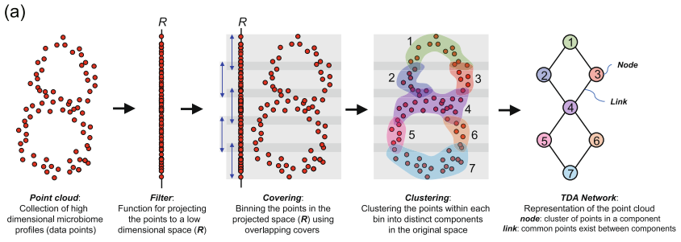

## Reeb graph

In topology, one way to visualize a complicated space is to collapse the connected components of the level sets of a function $f : X \to \mathbb{R}$. The result is the [Reeb graph](https://en.wikipedia.org/wiki/Reeb_graph).

So instead of trying to look directly at a high-dimensional object, we look at how it changes along the values of a function. The Reeb graph records how those level sets split, merge, and loop.

![The Reeb graph of a torus using the projection on the z-axis. Source: Wikipedia^[https://commons.wikimedia.org/wiki/File:3D-Leveltorus-Reebgraph.png]](images/reeb.png)

### The classical Mapper construction

Mapper is the data-analytic analogue of the Reeb graph. We replace the continuous ingredients by discrete ones:

- $X$ becomes a finite metric space, or point cloud;
- $f : X \to \mathbb{R}$ becomes any real-valued function on the data;
- instead of inverse images of points, we use inverse images of overlapping intervals;
- instead of connected components, we cluster each inverse image.

The resulting clusters form a cover of the data, and the Mapper graph is the nerve of that cover: two nodes are connected when the corresponding clusters share at least one data point.



This graph can shed light on the geometry of the dataset:

- nodes represent clusters of data points;
- node colors summarize some statistic of the points in that node;
- edges indicate overlap between nearby clusters;
- loops suggest circular or toroidal structure;
- branches suggest flares or bifurcations in the data.

## An example in Julia

```{julia}
using CairoMakie
using MetricSpaces
using MetricSpaces.Datasets
using TDAplots
using TDAmapper.ImageCovers
using TDAmapper.IntervalCovers
using TDAmapper.Refiners
```

We work with a torus. It is a useful example because its Reeb graph under a coordinate projection has a recognizable loop-with-flares structure:

```{julia}
X = torus(2000)
fv = first.(X)
Xmat = as_matrix(X)

fig = Figure()
ax = Axis3(fig[1, 1], title = "Torus colored by the filter value")
scatter!(ax, Xmat[1, :], Xmat[2, :], Xmat[3, :], color = fv, markersize = 3)
fig
```

The filter function is simply the projection onto the first coordinate:

```{julia}
fv[1:5]
```

To run classical Mapper we need:

- an image cover of the filter values;
- a clustering rule for each inverse image.

Here `Uniform(length = 12, expansion = 0.35)` creates overlapping intervals in the image of the filter, and `DBscan` refines each inverse image into connected dense pieces.

```{julia}
C = R1Cover(fv, Uniform(length = 12, expansion = 0.35))
clustering = DBscan(radius = 1.2, min_neighbors = 3)

mp = classical_mapper(X, C, clustering)
mp
```

And now we plot the Mapper graph, coloring each node by the mean filter value of the points it contains:

```{julia}
mapper_plot(mp, node_values = node_colors(mp, fv))
```

The graph has the same qualitative feature as the Reeb graph of a torus: a looped structure with two flaring sides. That is exactly what Mapper is supposed to do: replace a complicated point cloud by a graph that still reflects the large-scale shape.

## A note on data representation

The local JuliaTDA packages work natively with `EuclideanSpace` objects from `MetricSpaces.jl`. If your data starts life as a `d \times n` matrix with one point per column, `EuclideanSpace(M)` converts it to the representation expected by `TDAmapper.jl`. When you want a matrix back for plotting, use `as_matrix(X)`.

So the original column-major convention of the book is still there conceptually; it is just wrapped in a metric-space type that keeps the downstream API cleaner.
