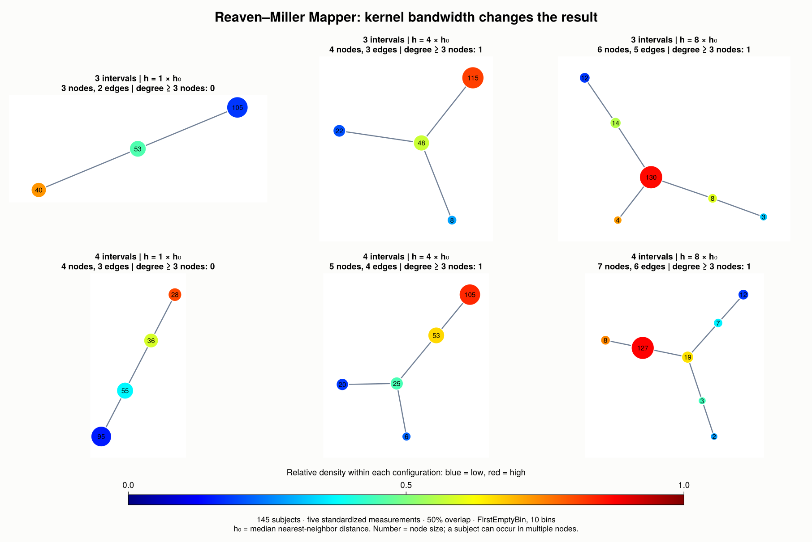
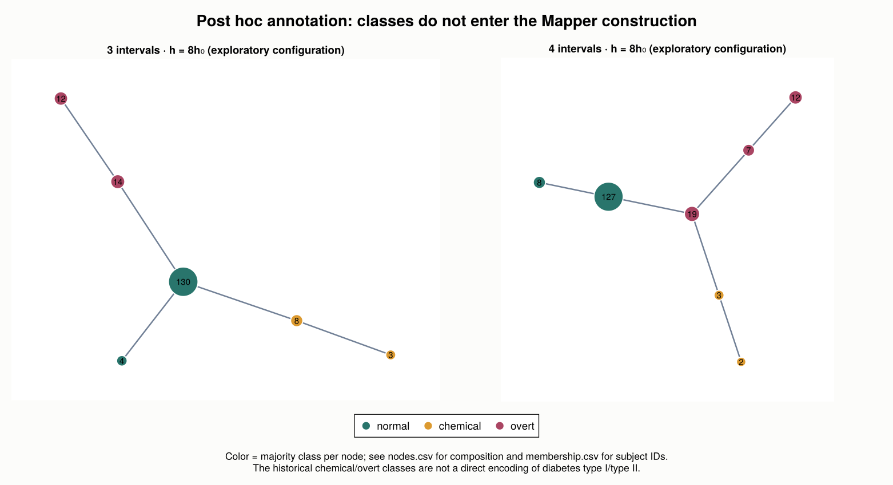
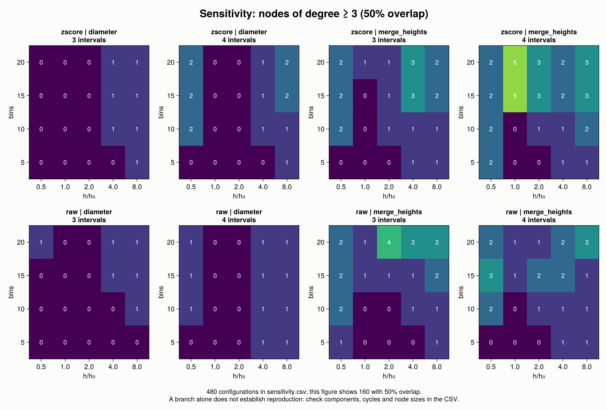

The original Mapper paper, @mapper, includes an analysis of 145 subjects from
the Reaven–Miller diabetes study. Its Figure 5 shows a region of high density
with two flares ending in lower-density nodes. We will try to recover this
structure with the tools introduced in the [Mapper chapter](mapper.qmd).

**The outcome is a partial qualitative reproduction.** Wider kernels recover
a branched graph, but the automatic bandwidth produces a chain. Our graphs
are coarser than the published figure, and we have not matched its individual
nodes or their memberships.

## What the paper specifies

The target experiment uses a Gaussian density filter, single-linkage clustering,
and covers with **3 or 4 intervals and 50% overlap**. The text mentions six
measurements, including age. The two public distributions we found contain
five measurements and the class annotation. The kernel bandwidth, histogram
bin count, and preprocessing for this experiment are not specified in the paper.

| Ingredient | This reproduction |
|---|---|
| Subjects | All 145 rows in the public Reaven–Miller distribution |
| Measurements | `rw`, `fpg`, `glucose`, `insulin`, `sspg`; age is unavailable |
| Geometry | Euclidean distance; z-score per measurement in the main illustrations |
| Filter | Gaussian KDE on the complete dataset |
| Bandwidth | Multiples of the median nearest-neighbor distance |
| Cover | Equal-width intervals aligned with the filter's minimum and maximum |
| Clustering | Single linkage with `FirstEmptyBin`, 10 bins in the main illustrations |
| Nerve | `SimpleNerve`: connect nodes that share at least one subject |

These choices complete an incompletely specified protocol. They are not claimed
to be the unpublished settings of the original MATLAB implementation.

## Obtain and verify the data

The underlying observations come from @reaven1979 and the collection of
@andrews1985. We downloaded the RData objects distributed by `rrcov` and
`loon.data` at fixed revisions. **All 725 numerical measurements and all 145
class annotations agree in the same row order** between the two copies.

| Column | Measurement |
|---|---|
| `rw` | Relative weight |
| `fpg` | Fasting plasma glucose |
| `glucose` | Area under the plasma glucose curve during the oral glucose tolerance test |
| `insulin` | Area under the plasma insulin curve during the same test |
| `sspg` | Steady-state plasma glucose response |

The `group` column contains 76 `normal`, 36 `chemical`, and 33 `overt` subjects.
These historical labels are used only after constructing Mapper. They do not
enter the distances, density, cover, clustering, or parameter grid, and are not
a direct encoding of diabetes type I/II.

The book includes the [CSV](reproductions/experiments/mapper2007/data/diabetes.csv),
[source revisions and checksums](reproductions/experiments/mapper2007/data/provenance.toml),
and both upstream RData files. The CSV can be analyzed entirely in Julia.
Base R is needed only to rebuild the CSV or run the optional source-to-source check.

### Prepare the environment

Run the following commands **from the book's root directory**, with the
book environment prepared as described in the introduction. The setup script
uses the frozen book packages when available, or the sibling JuliaTDA checkouts,
and creates a separate environment for this reproduction.

```bash
JULIA_PKG_PRECOMPILE_AUTO=0 julia --startup-file=no reproductions/experiments/mapper2007/scripts/setup.jl
julia --project=reproductions/experiments/mapper2007 --startup-file=no reproductions/experiments/mapper2007/scripts/download.jl
```

The second command verifies the bundled files against their SHA256 hashes and
downloads a pinned source only when that file is missing. To reconstruct the
CSV or cross-check the two RData objects, use:

```bash
julia --project=reproductions/experiments/mapper2007 --startup-file=no reproductions/experiments/mapper2007/scripts/download.jl --rebuild-csv
Rscript --vanilla reproductions/experiments/mapper2007/scripts/crosscheck.R reproductions/experiments/mapper2007
```

The Julia blocks below form a sequence to run from the same book directory.
They are displayed as code, with the recorded outputs presented separately.

```julia
import Pkg
repro_dir = joinpath(pwd(), "reproductions", "experiments", "mapper2007")
Pkg.activate(repro_dir)

using TDAplots
using TDAmapper.ImageCovers, TDAmapper.IntervalCovers
using TDAmapper.Refiners, TDAmapper.Nerves
using Statistics, DelimitedFiles, SHA, TOML
using CairoMakie
import Graphs
```

### Read the verified observations

```julia
csv_path = joinpath(repro_dir, "data", "diabetes.csv")
provenance = TOML.parsefile(joinpath(repro_dir, "data", "provenance.toml"))
@assert bytes2hex(sha256(read(csv_path))) == provenance["csv_sha256"]

rows, header = readdlm(csv_path, ',', Any; header = true)
@assert vec(String.(header)) ==
    ["patient_id", "rw", "fpg", "glucose", "insulin", "sspg", "group"]
@assert size(rows) == (145, 7)
@assert Int.(rows[:, 1]) == collect(1:145)

measurements = Float64.(rows[:, 2:6])
groups = String.(rows[:, 7])
@assert all(isfinite, measurements)
@assert [count(==(g), groups) for g in ("normal", "chemical", "overt")] ==
    [76, 36, 33]
```

`patient_id` is the original row position, not a personal identifier. Keeping
it allows us to track a subject through the cover and the final graph.

## Construct the geometry and density filter

The measurements have very different scales. We standardize each coordinate
using its mean and sample standard deviation over all 145 subjects. The
sensitivity analysis also includes the unstandardized data.

```julia
raw_space = EuclideanSpace(permutedims(measurements))
X = EuclideanSpace(standardize(raw_space))
```

We evaluate the Gaussian filter

$$
f_h(x_i) = \frac{1}{n}\sum_{j=1}^{n}
\exp\!\left(-\frac{d(x_i,x_j)^2}{2h^2}\right).
$$

The term with $j=i$ is included. A positive multiplicative normalization factor
would not change the pullback of a cover built over the filter's own range.
The parameterization corresponds to the paper's kernel with $\varepsilon=2h^2$.

Since the original bandwidth is unknown, define $h_0$ as the median distance
to the nearest *other* subject. `distance_to_measure(X, X)` includes each point
itself, so taking the maximum of the two nearest distances gives the desired
nearest-neighbor distance.

```julia
nearest_distances = distance_to_measure(
    X, X; k = 2, summary_function = maximum,
)
h0 = median(nearest_distances)
```

Here $h_0 \approx 0.4822665321$. We retain the automatic reference $h=h_0$
and compare it with larger widths rather than displaying only the configuration
that produces a branch.

## Build a cover with the stated overlap

For $k$ intervals and overlap fraction $g$, let the filter range have length $L$.
The interval width and step are

$$
w = \frac{L}{k-(k-1)g}, \qquad s=(1-g)w.
$$

The first interval begins at the minimum filter value; the last ends at the
maximum. Adjacent intervals overlap by $gw$. We use `ManualCover` to specify
this convention explicitly.

```julia
function endpoint_cover(f; intervals, overlap = 0.5)
    @assert intervals >= 2
    @assert 0 <= overlap < 1
    lo, hi = extrema(f)
    @assert hi > lo
    width = (hi - lo) / (intervals - (intervals - 1) * overlap)
    step = width * (1 - overlap)
    U = [
        Interval(lo + (i - 1) * step,
                 i == intervals ? hi : lo + (i - 1) * step + width)
        for i in 1:intervals
    ]
    R1Cover(f, ManualCover(U))
end
```

This is not the same as `Uniform(expansion=0.5)`: `expansion` has a different
meaning, and `Uniform` centers intervals at division points that include the
endpoints. The alignment of the cover can affect the result as well as its overlap.

## Cluster the pullbacks and construct Mapper

`FirstEmptyBin` builds a single-linkage hierarchy within each pullback. It bins
the merge heights and cuts at the midpoint of the first empty bin. In this
implementation the histogram range extends to the pullback's diameter; when
there is no empty bin, the pullback remains one cluster.

```julia
function fit_reaven_mapper(X; factor, intervals)
    f = kde(X; bandwidth = factor * h0)
    cover = endpoint_cover(f; intervals, overlap = 0.5)
    M = classical_mapper(X, cover, FirstEmptyBin(num_bins = 10), SimpleNerve())
    (; M, f)
end

function summarize_graph(M)
    components = Graphs.connected_components(M.g)
    (
        nodes = Graphs.nv(M.g),
        edges = Graphs.ne(M.g),
        components = length(components),
        graph_cycle_rank = Graphs.ne(M.g) - Graphs.nv(M.g) + length(components),
        branch_nodes = count(>=(3), Graphs.degree(M.g)),
        covered_subjects = length(unique(reduce(vcat, M.C))),
    )
end

illustrated_models = [
    (; factor, intervals, fit_reaven_mapper(X; factor, intervals)...)
    for factor in (1.0, 4.0, 8.0) for intervals in (3, 4)
]

for model in illustrated_models
    println((; model.factor, model.intervals, summarize_graph(model.M)...))
end
```

## Compare the recorded results

| Intervals | $h/h_0$ | Nodes | Edges | Components | Nodes of degree $\geq 3$ | Structure |
|---:|---:|---:|---:|---:|---:|---|
| 3 | 1 | 3 | 2 | 1 | 0 | Chain |
| 4 | 1 | 4 | 3 | 1 | 0 | Chain |
| 3 | 4 | 4 | 3 | 1 | 1 | Branched tree |
| 4 | 4 | 5 | 4 | 1 | 1 | Branched tree |
| 3 | 8 | 6 | 5 | 1 | 1 | Branched tree |
| 4 | 8 | 7 | 6 | 1 | 1 | Branched tree |

All six graphs are connected, have no graph cycles, and cover every subject.

{#fig-reproduction-mapper-bandwidth fig-alt="Six Mapper graphs comparing three and four intervals at bandwidth factors one, four and eight. Factor one produces chains; wider kernels produce branched trees."}

We can inspect an individual model through the public plotting API:

```julia
model = only(m for m in illustrated_models if m.factor == 8.0 && m.intervals == 4)
mapper_plot(
    model.M;
    node_values = node_colors(model.M, model.f),
    node_positions = layout_spring(model.M; seed = 2007, iterations = 300),
    node_size = 13 .+ 4sqrt.(length.(model.M.C)),
    colormap = :jet,
)
```

### Annotate classes after constructing the graph

Only now do we examine the historical classes. A node can contain several
classes, so its majority label is a summary, not a claim that it is homogeneous.

```julia
node_composition = [
    (
        node_id = i,
        size = length(ids),
        normal = count(==("normal"), groups[ids]),
        chemical = count(==("chemical"), groups[ids]),
        overt = count(==("overt"), groups[ids]),
    )
    for (i, ids) in enumerate(model.M.C)
]
```

For $h=8h_0$, the two lower-density endpoints contain:

| Cover | Chemical endpoint | Overt endpoint |
|---|---|---|
| 3 intervals | 3/3 chemical | 12/12 overt |
| 4 intervals | 2/2 chemical | 12/12 overt |

{#fig-reproduction-mapper-classes fig-alt="Three- and four-interval Mapper graphs with normal nodes in green, chemical nodes in orange and overt nodes in purple."}

This is a qualitative agreement with the flare pattern, not a complete recovery
of the classes. For example, the 130-subject node in the three-interval graph
contains 76 normal, 33 chemical, and 21 overt subjects. The overlapping node
sizes must not be summed as though they were disjoint groups.

## Examine sensitivity

The six illustrations are part of a grid of **480 configurations**:

| Choice | Values |
|---|---|
| Scaling | z-score; raw measurements |
| Bandwidth factor | 0.5, 1, 2, 4, 8 |
| Histogram bins | 5, 10, 15, 20 |
| Interval count | 3, 4 |
| Histogram range | Pullback diameter; maximum merge height |
| Overlap fraction | 0.35, 0.50, 0.65 |

The merge-height variant is a sensitivity comparison, not a recovered MATLAB
setting. All 480 configurations cover the 145 subjects. Among the 160 with
50% overlap, 49 are connected trees with at least one node of degree three or more:

| Scaling | Histogram range | Branched connected trees / configurations |
|---|---|---:|
| z-score | Diameter | 15/40 |
| z-score | Merge heights | 7/40 |
| Raw | Diameter | 17/40 |
| Raw | Merge heights | 10/40 |

{#fig-reproduction-mapper-sensitivity fig-alt="Eight heatmaps show that branch counts vary with kernel bandwidth, histogram bins, scaling and histogram range."}

These counts describe the chosen grid; they are not probabilities or statistical
tests. A branch alone does not establish the two particular flares of interest.
Also, `graph_cycle_rank` counts cycles of the graph: with triple intersections
it need not equal $H_1$ of the full simplicial nerve.

The automatic reference bandwidth fails to recover the bifurcation, and the
wider-kernel configurations were inspected on these same observations. There
is no held-out evaluation or proof of statistical robustness.

## Run the complete experiment and inspect its checks

To regenerate the parameter grid and all figures, run:

```bash
julia --project=reproductions/experiments/mapper2007 --startup-file=no reproductions/experiments/mapper2007/scripts/run.jl
```

Pass `--no-plots` to run the analysis and integrity checks without rendering
figures. The checks compare the Gaussian KDE with its explicit sum, every
nerve edge with the intersection of the corresponding subject sets, and
single linkage with connected components of a graph thresholded at the cutoff.
They also verify complete subject coverage. The checks passed in the recorded
run; two complete executions of the original experiment produced identical
summary and sensitivity CSVs.

| Artifact | Contents |
|---|---|
| [Selected models](reproductions/experiments/mapper2007/results/selected_models.csv) | Metrics for the six illustrations |
| [Sensitivity grid](reproductions/experiments/mapper2007/results/sensitivity.csv) | All 480 parameter combinations and graph summaries |
| [Configuration](reproductions/experiments/mapper2007/config.toml) | All grid and illustration choices |
| [Audit](reproductions/experiments/mapper2007/results/audit.toml) | Recorded integrity checks |
| [Run metadata](reproductions/experiments/mapper2007/results/run_metadata.toml) | Julia version, checksums, commits, and local source fingerprints |
| [Resolved environment](reproductions/experiments/mapper2007/environment.lock.toml) | Package versions and relative paths to the frozen book sources |
| [Four-interval node composition](reproductions/experiments/mapper2007/results/k4_h8/nodes.csv) | Counts of each class in each node |
| [Four-interval memberships](reproductions/experiments/mapper2007/results/k4_h8/membership.csv) | Original subject row IDs for every node |
| [Four-interval edges](reproductions/experiments/mapper2007/results/k4_h8/edges.csv) | Edges and counts of shared subjects |
| [Analysis script](reproductions/experiments/mapper2007/scripts/run.jl) | The complete executable experiment |

Equivalent node, edge, membership, interval, and filter files are available
for each of the six illustrated models. The run metadata fingerprints the
package source files actually used, including the frozen book snapshots.
These fingerprints also capture uncommitted changes when running with sibling
checkouts; commit IDs alone would not describe those changes.

## What has been reproduced?

We recovered a high-density region connected to two lower-density endpoints
in several explicitly recorded configurations, including endpoints enriched
for the two historical diabetic labels. We did not recover the published
nodes, their sizes, or their exact memberships. The graphs are coarser, the
automatic bandwidth gives a different structure, and the public dataset lacks
the age variable mentioned in the paper.

A more faithful match requires the missing measurement and the original
bandwidth, preprocessing, and histogram convention. The paper's torus and
3D shape-recognition experiments are outside this first reproduction.
