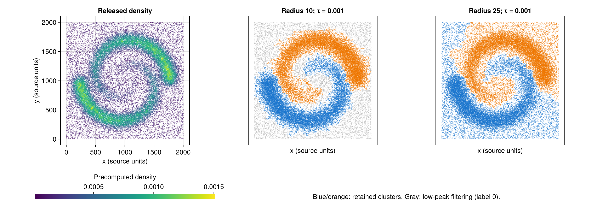

---
execute:
  enabled: false
---

# ToMATo: recovering the twin spirals {#sec-reproduction-tomato2013}

The JuliaTDA implementation recovers **two spiral-shaped clusters** from all 114,562 points in the original authors' released benchmark. Both documented graph radii give the expected large-scale structure. At the smaller radius, the final height filter removes 17,688 points; at the larger radius, every point belongs to one of the two clusters.

This is a reproduction of the **released benchmark and its README commands**, with a qualitative comparison to the paper. The released file is a different realization from the 10,000-point example in the publication. An independent audit also reveals differences in some peak deaths and eight final assignments at the smaller radius. Those differences are retained in the outputs and discussed below.

## The paper and the target

Frédéric Chazal, Leonidas J. Guibas, Steve Y. Oudot and Primoz Skraba introduced ToMATo in *Persistence-Based Clustering in Riemannian Manifolds*, [Journal of the ACM 60(6), article 41 (2013)](https://doi.org/10.1145/2535927). We use the [authors' journal manuscript](https://geometrica.saclay.inria.fr/data/Steve.Oudot/clustering/jacm_oudot.pdf), especially Figure 2, Section 5.1 and Figures 6--8.

The published twin-spirals example contains 10,000 points in the unit square. A radius graph with $\delta=0.04$ and an inverse distance-to-measure density produce two prominent peaks. A smaller radius, $\delta=0.02$, creates many disconnected background components; a final filter on peak height removes much of that background. A separate experiment uses roughly 100,000 points. These are useful targets because the two clusters are not convex, and background points can connect them geometrically.

The mechanism is the one developed in the [ToMATo chapter](../tomato.qmd): follow higher-density neighbors, measure how far each peak stands above its joining saddle, and merge peaks below a persistence threshold.

## Obtain the authors' data

The [official ToMATo software page](https://geometrica.saclay.inria.fr/data/ToMATo/) supplies a source archive containing synthetic inputs. This experiment uses its `ToMaTo/inputs/spiral_w_density.txt`, whose three columns are $x$, $y$ and a precomputed density value. No class labels are supplied.

The archive's README specifies radius 10 with $\tau=10^{-3}$ for two spirals with background removed, and radius 25 with the same threshold for two clusters spanning the whole dataset. We follow those commands directly. The existing FCPS `Target` and `Hepta` examples in the book are separate datasets and do not reproduce this experiment.

| Choice | Published 10k example | Released benchmark used here |
|:--|:--|:--|
| Number of points | 10,000 | 114,562; no subsampling |
| Coordinates | Unit square | Native coordinates, approximately $[0,2006]^2$ |
| Radius | 0.04; comparison at 0.02 | 25; comparison at 10, from the archive README |
| Density | Inverse distance to measure | Author-supplied third column, unchanged |
| Threshold | Chosen from the persistence gap | $10^{-3}$, from the archive README |
| Comparison target | Two prominent spirals | Two spirals; filtering at radius 10 |

The exact coordinate ranges are $x\in[1.497,2005.79]$ and $y\in[1.145,2005.63]$. Density ranges from $1.16451\times10^{-5}$ to $1.51124\times10^{-3}$. Radius and threshold therefore use **the released file's units**. We do not transfer the paper's unit-square radii to these coordinates, or equate the released realization with the paper's 100k sample.

The compressed archive is stored with the experiment. Loading it verifies these SHA-256 fingerprints before using any values:

```text
Archive:
15d360feb89e7f92aa3e00c0500e4ee439f6cb565932e82547364fcfd777f339
spiral_w_density.txt:
cdb64bbd14837a43bf3229c1a7500f7a662ac45ad0c40f2821473580965c82a3
```

The source was retrieved on October 3, 2026. The archive also preserves its original README, source code and GPL license. Full provenance and parameters are in [config.toml](experiments/chazal2013/config.toml).

## Reconstruct the analysis

### Preserve the density

We use the supplied density rather than inventing missing estimation parameters. This reproduces the graph-and-clustering stages, but does not independently reproduce the original density estimation stage.

For clarity, the journal manuscript defines the empirical distance to measure as the root mean square of the distances to $k$ nearest neighbors, and uses its reciprocal as density. With the local API, that definition would require an explicit summary function:

```julia
using MetricSpaces, Statistics

# Formula illustration, not used to replace the released density.
function rms_density(X; k)
    rms_distance = distance_to_measure(
        X, X; k=k, summary_function=d -> sqrt(mean(abs2, d)),
    )
    return 1 ./ rms_distance
end
```

`knn_density` uses the reciprocal of the **maximum** neighbor distance. Its default is therefore a different estimator. Moreover, the released `Density.h` squares ANN's already-squared neighbor distances inside its distance-based estimator. The archive does not document how the saved spiral density was produced. We preserve the supplied values and make no claim to recover the unpublished estimator settings from that wrapper.

### Build an actual radius graph

The book's demonstration graph combines a radius, a degree cap and a nearest-neighbor fallback. Here we need the complete radius graph: vertices are adjacent exactly when their Euclidean distance is at most the chosen radius.

```julia
using ToMATo, MetricSpaces, Graphs, DelimitedFiles

archive = "TDA_with_julia/reproductions/experiments/chazal2013/data/ToMATo_code.tar.gz"
member = "ToMaTo/inputs/spiral_w_density.txt"
raw = readdlm(IOBuffer(read(`tar -xOzf $archive $member`)), Float64)
X = EuclideanSpace(permutedims(raw[:, 1:2]))
density = raw[:, 3]

radius = 25.0
g = proximity_graph(
    X, radius; min_k_ball=0, max_k_ball=length(X), k_nn=0,
)
(nv(g), ne(g), length(connected_components(g)))
# (114562, 5864965, 1)
```

`min_k_ball=0` disables the fallback, and `max_k_ball=length(X)` avoids truncation, including the self-entry in a radius query. The experiment checks every edge against the requested distance bound. The edge counts also agree with an independent radius-neighbor count.

### Inspect persistence, then apply the documented threshold

```julia
_, peak_pairs = tomato(X, g, density, Inf)

tau = 1e-3
labels, _ = tomato(
    X, g, density, tau; max_cluster_height=tau,
)
[count(==(k), labels) for k in 0:2]
# [0, 58955, 55607]
```

The two occurrences of `tau` serve different purposes. The positional threshold merges peaks whose **birth minus saddle density** is less than `tau`. `max_cluster_height` then marks a remaining cluster as background when its **absolute peak density** is below that value. Label `0` is this filtered category, not a third spiral.

Run with `Inf` to obtain the merge diagram. Run with `0` to see unmerged modes. The library stores an essential class as `[birth, Inf]`; this is a no-merge sentinel, not a finite death density. Our figure places those records in a separate strip.

## Results on every released point

{#fig-tomato-reproduction-spirals}

| Radius | Graph edges | Connected components | Unmerged peaks | Cluster 1 | Cluster 2 | Filtered points |
|--:|--:|--:|--:|--:|--:|--:|
| 10 | 941,251 | 2,411 | 8,613 | 48,215 | 48,659 | 17,688 |
| 25 | 5,864,965 | 1 | 942 | 58,955 | 55,607 | 0 |

At radius 10, **15.44%** of points receive label `0`. The retained populations trace the two spirals, while many sparse background components are removed. At radius 25, the graph is connected, all points are assigned, and the two spiral populations remain visible. These outcomes match the qualitative behavior described by the archive README.

{#fig-tomato-reproduction-persistence}

The largest finite lifetime is separated from the next largest:

| Radius | Largest finite lifetime | Second finite lifetime | Selected threshold |
|--:|--:|--:|--:|
| 10 | 0.001122660 | 0.000411036 | 0.001 |
| 25 | 0.001078604 | 0.000356202 | 0.001 |

Thus the documented threshold lies inside the observed gap. One prominent finite peak survives alongside the highest essential peak. At the smaller radius, filtering removes the additional low-height essential classes.

We also varied the two thresholds together, following the archive's convention:

| Threshold | Positive clusters, radius 10 | Positive clusters, radius 25 |
|--:|--:|--:|
| 0 | 8,613 | 942 |
| 0.0005 | 2 | 2 |
| 0.00075 | 2 | 2 |
| 0.001 | 2 | 2 |
| 0.0012 | 1 | 1 |

The two-cluster result occupies an interval, rather than occurring at a single tested threshold. This is a sensitivity check on this file and density; it does not prove statistical significance or replace evaluating other graph scales. The full sweep, including 0.00025 and filtered counts, is saved as [threshold_sweep.csv](experiments/chazal2013/results/threshold_sweep.csv).

## Audit the implementation

A reproduction should also test whether a plausible picture hides a computational difference. [audit.jl](experiments/chazal2013/audit.jl) implements an independent union-find sweep of the density graph. Final plots and cluster counts above still come from the unmodified `ToMATo.jl` implementation.

The audit makes two comparisons. First, it uses the library's same strict condition that a neighbor must have higher density. This isolates merge bookkeeping. Second, it allows previously processed equal-density vertices, matching a deterministic total ordering of a graph superlevel filtration.

| Diagnostic | Radius 10 | Radius 25 |
|:--|--:|--:|
| Library essential records | 2,414 | 1 |
| Exact graph components / total-order essential classes | 2,411 | 1 |
| Peak death records differing from audit with the same tie rule | 22 of 8,613 | 6 of 942 |
| Final assignments differing from audit with the same tie rule | **8 of 114,562** | **0** |
| Final assignments differing from audit with total-order ties | 11 of 114,562 | 0 |

There are two limitations in this checkout:

1. **Equal densities.** The file has 62,293 distinct density values for 114,562 points. Strictly excluding equal-density neighbors can disconnect flat portions of the filtration. At radius 10 this produces three extra essential records. A graph superlevel filtration should have one essential class per connected component after all vertices appear.
2. **A root can become stale during a merge.** Inside a vertex's neighbor loop, the library stores a cluster root in `c_max`. After merging that root into a higher one, it does not refresh `c_max` before the next neighbor. The independent sweep updates the root after every union. A seven-vertex example in `check.jl` verifies the correct deaths when three peaks meet at one saddle and exposes this difference in the library.

Not all differing peak identities represent differing diagrams: two radius-25 records exchange death values between peaks with equal births. Nevertheless, other death discrepancies remain. Both audited diagrams agree with the library on the **two largest finite lifetimes**, and the independent implementations also find two retained clusters at the selected threshold. At radius 25 their final assignments agree exactly. At radius 10 the eight disagreements with the same tie rule amount to approximately **0.007%** of points.

The saved [death audit](experiments/chazal2013/results/death_audit.csv) includes every peak, its raw death, its audited death and a disagreement flag. The label files preserve raw and both audited assignments for every original row. No library source is changed by this experiment.

## Run and verify

From the monorepo root, create or refresh the experiment's private environment, then execute the analysis and checks:

```bash
JULIA_PKG_PRECOMPILE_AUTO=0 julia --startup-file=no \
  TDA_with_julia/reproductions/experiments/chazal2013/setup.jl

julia --startup-file=no --pkgimages=existing --compiled-modules=existing --threads=2 \
  --project=TDA_with_julia/reproductions/experiments/chazal2013/environment \
  TDA_with_julia/reproductions/experiments/chazal2013/run.jl

julia --startup-file=no \
  --project=TDA_with_julia/reproductions/experiments/chazal2013/environment \
  TDA_with_julia/reproductions/experiments/chazal2013/check.jl
```

The scripts use the local `ToMATo.jl` and `MetricSpaces.jl` packages directly. The private environment avoids changing the book environment or the earlier Mapper reproduction. Julia 1.12.5 was used for the recorded run. The command reuses existing native package images and disables new ones because the host cache filesystem ran out of space during Makie linking; this affects startup and compilation, not the algorithm. `tar` is required to read the compressed archive. A missing archive is downloaded from the recorded source and checked before use. The chapter itself uses static code and precomputed images, so book rendering requires neither Julia execution nor network access.

Checks cover dataset integrity, row count, graph radius bounds, graph size, documented cluster sizes and filtering, the persistence gap, threshold sensitivity, audit agreement at radius 25, and a hand-verifiable three-peak merge. [summary.csv](experiments/chazal2013/results/summary.csv) contains the numerical comparison. [provenance.toml](experiments/chazal2013/results/provenance.toml) records package-source fingerprints and the environment checksum; [runtime.csv](experiments/chazal2013/results/runtime.csv) records observed timings, including first-call compilation where applicable.

## What has been reproduced?

We recovered the released benchmark's **two prominent spirals**, the effect of changing the graph radius, and the documented removal of disconnected background components. We did not recover the exact 10k realization, the unpublished density settings, or a numerical accuracy score from the publication. There are no source class labels, so reporting accuracy or adjusted Rand index would require invented ground truth.

The experiment demonstrates the intended geometric behavior with the JuliaTDA tools while documenting their current numerical limits. It also leaves a concrete next step: after merge bookkeeping and equal-density handling are repaired in a separate library task, rerun the same saved file and compare the raw outputs against the independent audit.
