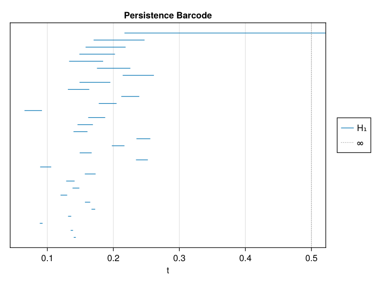
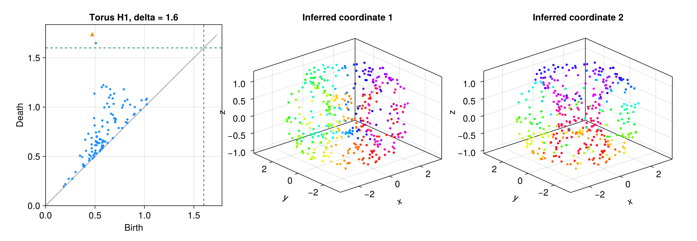
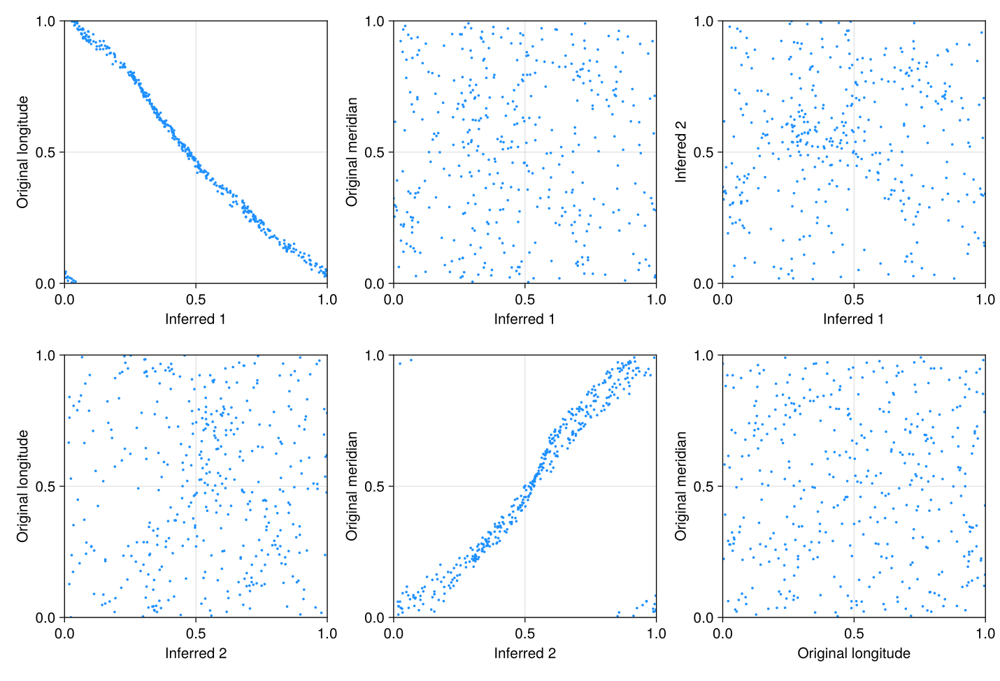
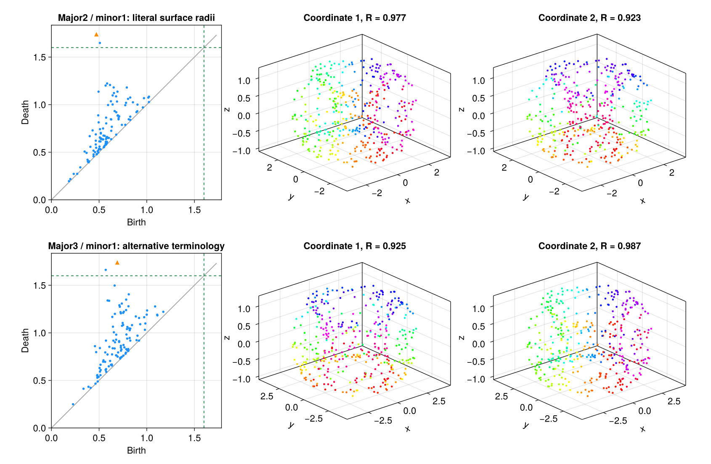

---
execute:
  enabled: false
---

# de Silva, Morozov, and Vejdemo-Johansson (2011): persistent cohomology and circular coordinates {#sec-reproduction-circular-coordinates}

A circle has one intrinsic parameter, but that parameter wraps around. An ordinary real coordinate must introduce a discontinuity. [de Silva, Morozov, and Vejdemo-Johansson, *Persistent Cohomology and Circular Coordinates*](https://doi.org/10.1007/s00454-011-9344-x), published in *Discrete & Computational Geometry* **45**, 737–759 (2011), turns a persistent cohomology class into a smooth coordinate with values in $\mathbb R/\mathbb Z$.

We reproduce the **noisy circle in Section 3.3/Figure 2** and the **torus in Section 3.7/Figure 6** of the [full 2011 author manuscript](https://mrzv.org/publications/circular/full-dcg/). The executed Julia pipeline recovers a degree-one circle coordinate, a localized noise coordinate, and two independent torus coordinates. It also reveals a substantial ambiguity in reconstructing the torus generator from the published radius terminology.

::: {.callout-note title="Source version and reproduction scope"}
The full 2011 manuscript specifies **200 noisy-circle points**. The older arXiv:0905.4887v1 describes 400 points and has a different author list and implementation. We follow the full version. The consulted publication and author page did not provide its original random realizations or seeds, so our data are newly generated from the stated distributions with a recorded seed. This is a reproduction of the procedure and qualitative findings, with numerical agreement measured explicitly.
:::

## Reconstruct the published synthetic data

The published settings and our choices are recorded in [config.toml](experiments/circular-coordinates2011/config.toml). No observational dataset is needed for these two targets: the data are sampled noisy geometric objects. We save every Cartesian observation, generating phase, and noise draw.

| Target | Points | Clean geometry | Additive noise per Cartesian coordinate | Filtration cutoff | Coordinate scale $\delta$ |
|---|---:|---|---|---:|---:|
| Noisy circle | 200 | Unit circle | Independent $U[0,0.4]$ | $0.5$ | $0.4$ and $0.14$ |
| Torus | 400 | Inner/outer surface radii interpreted as $1/3$ | Independent $U[0,0.2]$ | $\sqrt{3}$ | $1.6$ |

The noise is **positive uniform noise**, rather than centered or Gaussian noise. The torus is sampled uniformly in its parameter square, rather than uniformly with respect to surface area. We use `MersenneTwister(2011)` independently for each dataset. Uniform independent circle phases are our explicit choice: the full manuscript says points are distributed along the circle without giving their exact sampling law.

For circle phase $u\in[0,1)$, the observation is

$$
x=(\cos 2\pi u,\sin 2\pi u)+\eta,
\qquad \eta_j\sim U[0,0.4].
$$

For torus phases $(u,v)\in[0,1)^2$, our literal geometric interpretation gives major radius $R=2$ and tube radius $r=1$:

$$
x=\big((2+\cos2\pi v)\cos2\pi u,
        (2+\cos2\pi v)\sin2\pi u,
        \sin2\pi v\big)+\eta,
\qquad \eta_j\sim U[0,0.2].
$$

Its innermost and outermost distances to the vertical axis are $R-r=1$ and $R+r=3$. The paper does not print the parametrization formula. We therefore keep this interpretation explicit and test a second one below.

The following circle code matches the executed generator. Matrix columns are points, as in [Computing persistent homology](../computing_ph.qmd).

```julia
using Random, MetricSpaces, TDARipserer, TDAPersistenceDiagrams

rng = MersenneTwister(2011)
n = 200
u = rand(rng, n)
clean = permutedims(hcat(cos.(2π .* u), sin.(2π .* u)))
jitter = permutedims(0.4 .* rand(rng, n, 2))
X = clean + jitter

filtration = Rips(EuclideanSpace(X); threshold=0.5)
H1 = ripserer(filtration; dim_max=1, modulus=47, reps=true)[2]
global_bars = filter(b -> birth(b) < 0.4 < death(b), H1)
length(global_bars)  # 1
```

We use $\mathbb F_{47}$, the paper's example prime; it does not specify a prime separately for these figures. The Vietoris–Rips parameter is maximum **edge length**, following the definition in its Section 2.2. All vertices are retained. Generating phases are used only for evaluation, never to construct a cocycle or solve for a coordinate.

## From a finite-field cocycle to a harmonic coordinate

`TDARipserer` computes persistent cohomology and explicit representatives. At a selected scale $\delta$, we retain edges and triangles already present, restrict the representative to those edges, and replace residues modulo 47 by integers in $[-23,23]$.

A residue conversion alone does not prove that the result is an integer cocycle. We check every triangle:

$$
(d_1\alpha)(abc)=\alpha(bc)-\alpha(ac)+\alpha(ab)=0
$$

**exactly over the integers**, as well as congruence to the original finite-field representative. All selected lifts pass; no integer repair is needed for these realizations.

Let $B=d_0$ be the oriented edge–vertex incidence matrix. Harmonic smoothing solves

$$
\min_f\|\alpha+Bf\|_2^2,
\qquad h=\alpha+Bf,
\qquad \theta_i=f_i\pmod 1.
$$

We fix one potential to zero in each connected component. The full 2011 manuscript uses Dionysus and LSQR; our implementation uses Julia sparse QR for the same unweighted least-squares objective. The resulting $h$ should satisfy both $d_1h=0$ and $B^\mathsf T h=0$, and its periods around closed graph cycles should equal those of $\alpha$.

The complete, executable implementation is [run.jl](experiments/circular-coordinates2011/run.jl). After running it from the workspace root, its central solve can be inspected directly:

```julia
include("TDA_with_julia/reproductions/experiments/" *
        "circular-coordinates2011/run.jl")

B = globalcoord.skel.B
α = globalcoord.alpha
free = setdiff(collect(1:size(B, 2)), globalcoord.skel.anchors)
f = zeros(size(B, 2))
f[free] = -(B[:, free] \ Float64.(α))
h = Float64.(α) + B * f
θ = mod.(f, 1.0)

maximum(abs, B' * h)  # 4.33e-15
sum(abs2, α), sum(abs2, h)  # (24, 2.3100664201105845)
```

## The global circle and a local noise hole

At $\delta=0.4$, one persistent class remains. It gives a global angular coordinate. At $\delta=0.14$, six classes are alive. Following the paper's low-persistence comparison, we select the least-persistent active finite class with lifetime greater than $10^{-6}$. The particular representative selected for the published figure is unavailable, so our rule makes this choice reproducible.

{#fig-circular-noisy-circle width=100%}

We compare a coordinate $\theta$ with a known phase $u$ using circular association

$$
\mathcal R=\left|\frac1n\sum_i e^{2\pi\mathrm i(\theta_i-su_i)}\right|,
$$

where $s\in\{-1,1\}$ allows orientation reversal. The argument of that mean determines the optimal phase offset. Phase RMSE uses shortest wrapped differences after alignment. Association detects agreement with the parameter; a separate graph-cycle calculation checks topological winding.

| Circle coordinate | Birth | Death | $\mathcal R$ | Aligned phase RMSE | Largest fraction in one of 20 histogram bins |
|---|---:|---:|---:|---:|---:|
| Global, $\delta=0.4$ | 0.216790 | $>0.5$ | 0.974132 | 0.036413 cycles, or $13.11^\circ$ | 0.165 |
| Local, $\delta=0.14$ | 0.139960 | 0.143158 | 0.086603 | No useful global phase fit | 0.845 |

The global cocycle has integer period $+1$ on an actual closed cycle of the Rips graph whose known angular winding is $+1$. Smoothing preserves that period to $2.3\times10^{-16}$. The local class has period $1$ on a cycle with **zero original angular winding**: it identifies a small noise hole, rather than one traversal of the clean circle.

The global histogram covers the circle broadly but is visibly nonuniform. Its entropy is 2.715743 nats, compared with 0.484848 for the local coordinate and $\log20=2.995732$ for a perfectly uniform 20-bin histogram. This recovers the published contrast between a global parameter and a spiky local coordinate, without claiming exact uniformity.

At the local scale the graph has **17 connected components**. Their relative phase offsets are undetermined. Our zero anchor in each component contributes to the concentration near zero; consequently the local histogram is conditional on that gauge choice. The cocycle's localized integer period is stronger evidence than its histogram alone.

{#fig-circular-circle-barcode width=75%}

## Recover two torus coordinates

The literal major-$2$/minor-$1$ torus has exactly two classes alive at $\delta=1.6$. Their coordinate functions recover longitude and meridian, with signs and ordering that depend on the cohomology basis.

{#fig-circular-torus width=100%}

| Inferred coordinate | Birth | Death | Angular association | Aligned RMSE | Degree in (longitude, meridian) |
|---|---:|---:|---:|---:|---|
| 1 | 0.471846 | $>\sqrt3$ | 0.976901 | $12.36^\circ$ | $(-1,0)$ |
| 2 | 0.508340 | 1.648540 | 0.923251 | $22.76^\circ$ | $(0,+1)$ |

The inferred-versus-inferred scatter plot occupies the parameter square, while each coordinate correlates mainly with one original angle. Our sign/order differs from Figure 6, where the authors report meridian degree $-1$ and longitude degree $+1$. Those labels are not invariant properties of a persistence basis.

{#fig-circular-torus-correlations width=100%}

We do not infer degrees from these plots alone. On two recorded closed Rips graph cycles, the original angular winding vectors are $(1,0)$ and $(0,1)$. Integrating both integer cocycles gives the matrix

$$
A=\begin{pmatrix}-1&0\\0&1\end{pmatrix},\qquad |\det A|=1.
$$

This certifies primitive integer periods forming a full angular basis on these loops. It also agrees with the best circular fit over integer combinations in $[-2,2]^2$. The actual edge walks and period matrices are saved in [the results directory](experiments/circular-coordinates2011/README.md), so this conclusion can be checked independently of the scatter plots.

## Audit the torus radius interpretation

There is a meaningful quantitative mismatch. At the published filtration cutoffs, our literal torus contains **181,167** vertices, edges, and triangles; the manuscript reports **61,522** simplices. The circle count is 26,038 versus 23,475. Fresh random samples can change these counts, but a nearly threefold torus discrepancy warrants a geometric audit.

We therefore execute a second interpretation: major radius $R=3$, tube radius $r=1$. It has innermost/outermost surface distances $2/4$, so it is an **alternative reading of the terminology**, rather than the literal surface radii. Its observation formula replaces $2+\cos2\pi v$ by $3+\cos2\pi v$. We reuse the exact same 400 phases and every noise draw, changing only $R$.

| Torus reconstruction | Edges at $\sqrt3$ | Triangles at $\sqrt3$ | Total 2-skeleton | Difference from published count |
|---|---:|---:|---:|---:|
| Literal surface radii: $R=2,r=1$ | 12,661 | 168,106 | 181,167 | $+194.5\%$ |
| Alternative terminology: $R=3,r=1$ | 7,667 | 58,944 | 67,011 | $+8.9\%$ |
| Published realization | Not listed | Not listed | 61,522 | Reference |

The alternative geometry is much closer in complex size. At $\delta=1.6$ it also yields two active coordinates: meridian association 0.925481 with $22.49^\circ$ RMSE, and reversed longitude association 0.987175 with $9.20^\circ$ RMSE. Their integer degree matrix is

$$
A_{\mathrm{alternative}}=\begin{pmatrix}0&1\\-1&0\end{pmatrix},
\qquad\det A_{\mathrm{alternative}}=1.
$$

{#fig-circular-radius-audit width=100%}

This result suggests radius terminology as a plausible source of disagreement. It does **not** identify the authors' original generator or recover their exact sample. Neither interpretation reproduces their claim of essentially perfect angular recovery numerically; both retain appreciable meridian distortion under our measured RMSE.

## Compare the current Julia circular-coordinate API

`TDARipserer.CircularCoordinates` implements the later Perea sparse principal-$\mathbb Z$-bundle construction, according to its local documentation. Even when every point is a landmark, its partition-of-unity extension differs from the 2011 vertex construction. We therefore test it separately on the same noisy circle.

We pass the ordered indices of **all 200 points** as landmarks. A full-filtration preliminary computation provides a finite death for the longest class, allowing coverage to be chosen so that the API's smoothing scale is $0.5$, with cover radius $0.25$. The coverage value is 0.0667269102. The original global vertex coordinate used $\delta=0.4$, so scale and extension method both differ.

```julia
points = EuclideanSpace(X)
full_H1 = ripserer(Rips(points); dim_max=1, modulus=47)[2]
bar = full_H1[argmax(persistence.(full_H1))]
coverage = (0.25 - birth(bar)) / (death(bar)/2 - birth(bar))
cc = CircularCoordinates(points, collect(eachindex(points));
    modulus=47, coverage=coverage, dim_max=1)
api_coordinate = cc(points)[:, 1]
```

The API returns all 200 coordinates, with angular association **0.967301** and winding degree $-1$ on the recorded circle loop. After sign and offset alignment, its RMSE against our 2011 vertex coordinate is **0.013858 cycles**, or $4.99^\circ$. This supports consistency between the two constructions on this example; it is not independent verification, because both use the same cohomology backend.

## Reproduction files and scientific checks

Run the experiment from the workspace root using its private environment:

```bash
JULIA_PKG_PRECOMPILE_AUTO=0 julia --compiled-modules=existing --pkgimages=existing --startup-file=no \
  TDA_with_julia/reproductions/experiments/circular-coordinates2011/setup.jl

JULIA_PKG_PRECOMPILE_AUTO=0 julia --compiled-modules=existing --pkgimages=existing --startup-file=no \
  --project=TDA_with_julia/reproductions/experiments/circular-coordinates2011/environment \
  TDA_with_julia/reproductions/experiments/circular-coordinates2011/run.jl
```

Setup may download dependencies. The analysis needs no network or source-PDF cache. The delivered lock uses relative paths to the local JuliaTDA packages. Rendering this chapter uses static Julia listings and precomputed images.

The final extended experiment passed **65 scientific checks**. The primary 45-check experiment was also run twice with byte-identical numerical summaries. Across all six selected coordinates, integer triangle coboundaries are exactly zero; the largest harmonic triangle residual is $2.23\times10^{-16}$ and harmonic stationarity is at most $5.72\times10^{-14}$. Every recorded nonzero cycle period is primitive and preserved by smoothing. For the primary torus, energies decrease from $630$ to $79.705545$ and from $810$ to $187.083835$.

The [experiment README](experiments/circular-coordinates2011/README.md) describes all artifacts. [summary.csv](experiments/circular-coordinates2011/results/summary.csv), [checks.csv](experiments/circular-coordinates2011/results/checks.csv), and [complex_sizes.csv](experiments/circular-coordinates2011/results/complex_sizes.csv) contain the actual computed numbers. Raw observations, per-edge cocycles, vertex potentials, graph cycles, and degree certificates are retained. Environment provenance records the Julia version, local package source hashes, Git heads, and whether each worktree was clean; [sha256.csv](experiments/circular-coordinates2011/results/sha256.csv) checksums the numerical and computational artifacts.

The primary manuscript SHA256 is `a1860a455dae2436c28792e21f59373e962ceef462a23f4382feee5d3e22d8c7`. A separate author-tutorial circle download has 1000 points and is not used as the paper's 200-point realization. Its URL and hash are recorded as an excluded download. The PDF and extracted text remain an ignored research cache.

The conclusions are bounded by one recorded sample, unconfirmed original seeds and circle sampling law, a different least-squares solver, an unspecified original low-persistence representative, and the torus-radius ambiguity. Deaths beyond finite cutoffs are right-censored, not genuinely infinite. Within those limits, the executed results recover the paper's distinction between stable global angles and local noise, and its use of two persistent cohomology classes to parametrize torus topology.
