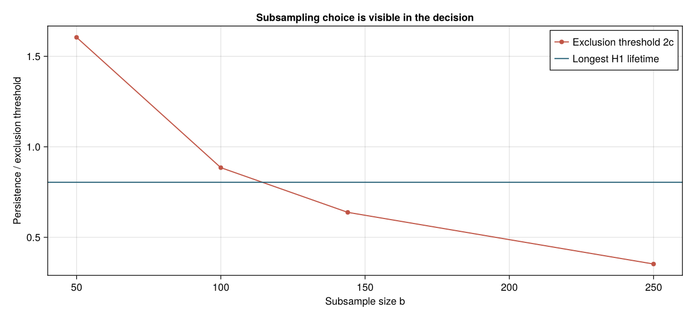

---
execute:
  enabled: false
---

# Fasy et al. (2014): confidence sets for persistence

Which points in a persistence diagram are large enough to survive sampling uncertainty? Fasy, Lecci, Rinaldo, Wasserman, Balakrishnan and Singh's [*Confidence sets for persistence diagrams*](https://doi.org/10.1214/14-AOS1252) connects confidence bands for functions to confidence sets for their diagrams. We reconstruct the uniform-circle experiment in **Example 13 and Figure 6**, using the [complete author manuscript](https://arxiv.org/html/1303.7117v3).

::: {.callout-note}
This is a **qualitative reproduction on a new realization of the published sampling model**. We recover the contrast between the conservative density bound and the density bootstrap, and the subsampling decision at our declared primary parameter. The original random seed, subsample size and density grid are not supplied in Example 13. We do not reproduce its pixels, establish empirical 95% coverage, or reproduce the additional concentration-of-measure curve.
:::

## Published target and local choices

The paper samples 500 points uniformly from the unit circle. It computes a Rips persistence diagram and a Gaussian kernel density estimate with bandwidth $h=0.3$. Its density bootstrap identifies a component and a loop, whereas the finite-sample density bound is too wide to identify these features. The support subsampling method also identifies a component and a loop.

There is no observational dataset to download for this example. The correct input is the specified probability model, rather than a noisy circle or a different sample size. Our generator and all settings are in [run.jl](experiments/fasy2014/run.jl) and [config.toml](experiments/fasy2014/config.toml); the realized [500 coordinates](experiments/fasy2014/results/points.csv) are retained.

| Quantity | Published | This reconstruction |
|:--|:--|:--|
| Sampling distribution | Uniform on the unit circle | $\theta_i\sim U[0,2\pi)$, $X_i=(\cos\theta_i,\sin\theta_i)$ |
| Sample size | 500 | 500 |
| Gaussian bandwidth | 0.3 | 0.3 |
| Confidence level | 95% | $\alpha=0.05$ |
| Seed | Not reported | `MersenneTwister(2014)` |
| Density grid | Not reported for this figure | $51\times51$ vertices on $[-2,2]^2$ |
| Density filtration | Upper level sets | Vertex lower star of the negative KDE on a fixed triangulation |
| Monte Carlo replicates | Not reported for this figure | 1,000 for each calibration |
| Subsample size | Not reported for this figure | $b=\lfloor n^{0.8}\rfloor=144$; also 50, 100 and 250 |
| Coefficients | Not specified in Example 13 | $\mathbb F_2$ |

```julia
using Random, TDARipserer, TDAPersistenceDiagrams

n = 500
rng = MersenneTwister(2014)
angles = 2pi .* rand(rng, n)
points = [(cos(t), sin(t)) for t in angles]
Dedge = ripserer(points; dim_max=1, modulus=2)
```

Native Rips birth times are **edge lengths**. Figure 6's loop dies near $0.9$, which is consistent with half the unit-circle Rips death $\sqrt3$, so we reconstruct its displayed scale as ball radius: divide every birth and death by two. This scale is inferred from the figure; the example does not explicitly give the conversion. Both [edge-length diagrams](experiments/fasy2014/results/rips_edge_length_diagrams.csv) and [radius diagrams](experiments/fasy2014/results/rips_radius_diagrams.csv) are exported. Rips remains a proxy for the distance-function/Čech diagram; rescaling does not turn Rips into Čech.

## Subsampling calibrates support uncertainty

Method I draws subsets **without replacement**. For a size-$b$ subset $S_b^*$ of the observed cloud $S_n$, its statistic is the Hausdorff distance

$$
T=H(S_b^*,S_n)=\max_{x\in S_n}\min_{y\in S_b^*}\lVert x-y\rVert_2.
$$

The reverse directed distance is zero because the subset is contained in the cloud. Following equation (13), let $q$ be the empirical upper 95% quantile of $T$, and use **$c_b=2q$**, including the paper's factor two. A finite diagram point must have lifetime greater than $2c_b$ to lie outside the diagonal uncertainty region.

```julia
selected = randperm(rng, n)[1:b]
T = maximum(minimum(hypot(points[i][1]-points[j][1],
                            points[i][2]-points[j][2])
                    for j in selected) for i in 1:n)
# Repeat 1,000 times, then use the paper's empirical tail quantile.
c_b = 2sort(statistics)[950]
```

The asymptotic requirement is $b\to\infty$ and $b=o(n/\log n)$. The sequence $\lfloor n^{0.8}\rfloor$ has that property; it does not guarantee that 500 observations are already in an accurate asymptotic regime. We therefore expose the finite-sample sensitivity instead of choosing an unreported $b$ and treating it as original.

| $b$ | Confidence radius $c_b$ | Exclusion threshold $2c_b$ | Significant $H_1$ intervals |
|--:|--:|--:|--:|
| 50 | 0.802454 | 1.604908 | 0 |
| 100 | 0.442394 | 0.884788 | 0 |
| **144** | **0.318886** | **0.637772** | **1** |
| 250 | 0.176127 | 0.352254 | 1 |

The single Rips-radius $H_1$ interval is $[0.0619166,0.866106)$, with lifetime $0.804189$. Thus the primary setting recovers the paper's qualitative decision, while two smaller subsets do not. Ordinary $H_0$ contains one essential component in every setting. The [subsampling results](experiments/fasy2014/results/subsampling.csv) and [all Hausdorff draws](experiments/fasy2014/results/subsample_draws.csv) retain these decisions.

{#fig-fasy-subsample}

## Density persistence has a different target

The density analysis estimates the smoothed population density $p_h=P*K_h$, not the support's distance function. For the normalized two-dimensional Gaussian,

$$
\widehat p_h(x)=\frac1n\sum_{i=1}^{n}
\frac{1}{2\pi h^2}\exp\left(-\frac{\lVert x-X_i\rVert^2}{2h^2}\right).
$$

As Section 4.4 does, we acknowledge a finite grid and a fixed triangulation. Each square is split along the same diagonal. Every vertex enters at $-\widehat p_h(x)$, and every edge and triangle at the maximum of its incident vertex values. These explicit face times matter: automatic insertion of missing faces in `Custom` creates a valid filtration, but does not by itself create the required vertex lower star.

```julia
# The executable script lists every vertex, edge and triangle explicitly.
filtration = Custom(simplices_and_max_vertex_births)
Ddensity = ripserer(filtration; dim_max=1, modulus=2)
```

Sublevel persistence of $-\widehat p_h$ is upper-level persistence of $\widehat p_h$. The finite-grid statistical target is the PL interpolant $p_h^\dagger$ of the population density on this same domain. A fixed triangulation makes the supremum error of the interpolants equal to the maximum error on the vertices, so the function stability bound applies directly.

### Conservative finite-grid bound

Lemma 11, equation (34), gives

$$
\Pr\bigl(\lVert\widehat p_h^\dagger-p_h^\dagger\rVert_\infty>c\bigr)
\le 2N\exp\left(-\frac{2nc^2h^{2D}}{K(0)^2}\right).
$$

With $D=2$, $K(0)=1/(2\pi)$ and $N=51^2$, solving this displayed bound gives

$$
c_{\rm finite}=\frac{1}{2\pi h^2}
\sqrt{\frac{\log(2N/\alpha)}{2n}}=0.190071.
$$

We derive the constant from equation (34) and the normalized two-dimensional kernel. This avoids ambiguity in equation (35), whose printed $(K(0)/h)^D$ must not be read as squaring the two-dimensional Gaussian maximum again.

### Bootstrap the observations, then recompute the KDE

Method IV resamples the 500 observations **with replacement**, recomputes the KDE and records

$$
T_j=\sqrt{nh^D}\,
\lVert\widehat p_h^{*(j)}-\widehat p_h\rVert_{\infty,G}.
$$

The paper's empirical tail quantile is the 950th ordered statistic of 1,000 replicates. Dividing that quantile by $\sqrt{nh^D}$ gives $c_{\rm boot}=0.0617035$. Equivalently, order the unscaled supremum errors. The factors cancel; dropping a factor in only one stage would change the radius.

This operation can use JuliaTDA's `PersistenceInference.confidence_band`. Each independent observation supplies a **whole Gaussian contribution function**, evaluated on the fixed grid:

```julia
using PersistenceInference

# samples has 500 rows (observations) and 2,601 columns (grid vertices).
band = confidence_band(samples; method=:bootstrap, studentize=false,
    n_boot=1000, alpha=0.05, rng=MersenneTwister(2014001))
c_boot = sort(band.maxima)[950] / sqrt(500)
```

The native band uses the $\sqrt n$ scale and an interpolated quantile for its own `critical_value`. The expression above implements the article's ordered tail quantile explicitly. Our executable analysis uses a faster count-vector matrix product for resampled KDEs. A separate [100-replicate audit](experiments/fasy2014/results/native_band_audit.csv), with identical draws on a $21\times21$ grid, agrees with the native resampling path to a maximum absolute difference of $3.61\times10^{-16}$.

`bootstrap_diagram(points)` performs another operation: it resamples a cloud and calibrates distances between its PH diagrams. That operation is neither Method I's without-replacement Hausdorff calibration nor Method IV's KDE supremum calibration. It is not substituted for either procedure here.

## Compare with Figure 6

{#fig-fasy-confidence}

The density loop has birth density $0.179410$ and death density $0.00683645$, giving lifetime $0.172574$. The bootstrap exclusion threshold is $0.123407$; the finite-bound threshold is $0.380142$. The loop therefore survives the bootstrap band and fails the conservative band, agreeing with the central contrast in the published figure.

| Density method | Radius $c$ | Dominant component under the zero-baseline convention | Significant finite $H_0$ bars | Significant $H_1$ bars |
|:--|--:|:--:|--:|--:|
| Finite-grid bound | 0.190071 | No | 0 | 0 |
| KDE bootstrap | 0.0617035 | Yes | 0 | 1 |

For comparison with the article's density drawing, the essential component is displayed with death density zero and birth density equal to the maximum KDE, $0.251410$. We apply the same finite height criterion to that display. **The native essential interval still has infinite death**, and is retained that way in exported diagrams and bottleneck calculations. The zero-baseline convention is not a new finite death time or a statistical test of the number of components of the final connected square.

The [density decisions](experiments/fasy2014/results/density_detection.csv), [full diagrams](experiments/fasy2014/results/density_diagrams.csv) and [bootstrap draws](experiments/fasy2014/results/bootstrap_draws.csv) are available for inspection.

## Sensitivity and independent checks

Five sample seeds and three grid sizes ($31$, $51$ and $71$) give 15 density analyses with fixed $n=500$ and $h=0.3$. Every bootstrap analysis identifies exactly one significant loop; every finite-grid bound identifies none. The [sensitivity table](experiments/fasy2014/results/sensitivity.csv) also records the component display criterion and all confidence radii. This is a stability check across selected realizations and resolutions, not a coverage study.

We approximate the known population KDE by deterministic angular quadrature with 4,096 equally spaced circle points. The [population grid](experiments/fasy2014/results/population_kde.csv) and [population diagram](experiments/fasy2014/results/population_diagrams.csv) make this comparison independent of bootstrap resampling. Its center value agrees with the analytic value $e^{-1/(2h^2)}/(2\pi h^2)$. The measured grid supremum error is $0.0368864$, below the bootstrap radius. The [bottleneck errors](experiments/fasy2014/results/population_error.csv) satisfy the actual measured function-error bound in both dimensions. Quadrature remains an approximation to the population target.

The unit-circle sample also has an analytic support-error check: if $g$ is its largest cyclic angular gap, then $H(S_n,S^1)=2\sin(g/4)=0.0619463$. This is smaller than each reported subsampling radius. The executable checks additionally verify every simplex's vertex-max birth, the edge and triangle counts, the quantile and subsampling factors, essential intervals, and an exact constant-translation sanity case.

All **18 executable assertions pass**. Repeating the final numerical analysis produces identical SHA-256 hashes for all 14 CSV files.

These checks validate the computation and recover the published qualitative decisions under declared settings. They do not reproduce the original realization, prove finite-sample bootstrap coverage, or remove the Rips approximation to the distance-function diagram.

## Re-run the experiment

From the JuliaTDA workspace root:

```bash
julia --startup-file=no TDA_with_julia/reproductions/experiments/fasy2014/setup.jl
julia --startup-file=no --compiled-modules=existing --pkgimages=existing \
  --project=TDA_with_julia/reproductions/experiments/fasy2014 \
  TDA_with_julia/reproductions/experiments/fasy2014/run.jl
julia --startup-file=no --project=TDA_with_julia/reproductions/experiments/fasy2014 \
  TDA_with_julia/reproductions/experiments/fasy2014/provenance.jl
```

The experiment has a [private project](experiments/fasy2014/Project.toml) and [resolved environment](experiments/fasy2014/environment.lock.toml). To restore the recorded versions, copy the lock to `Manifest.toml` in that directory before setup. Its local package paths are relative to the experiment directory. [provenance.toml](experiments/fasy2014/results/provenance.toml) records numerical hashes, the manuscript checksum and the local package source snapshots. The book uses saved figures and does not rerun this experiment during rendering.
