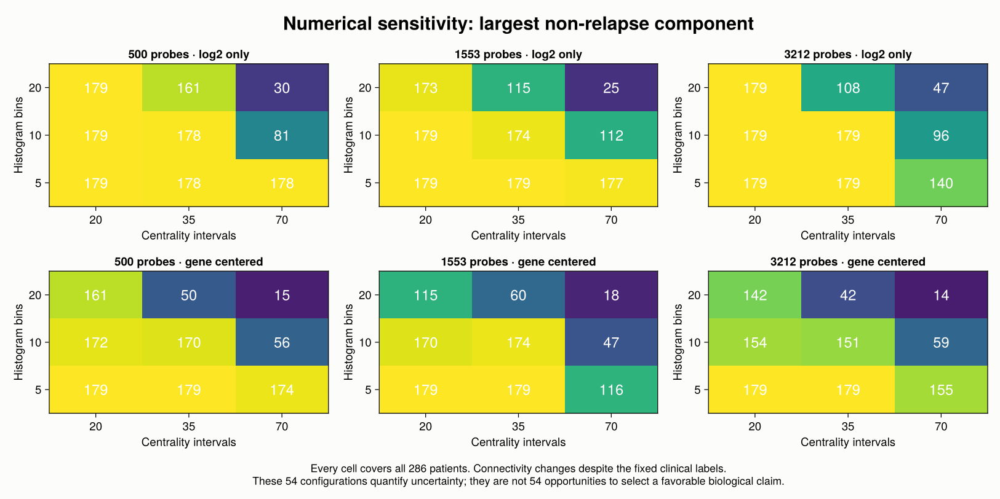
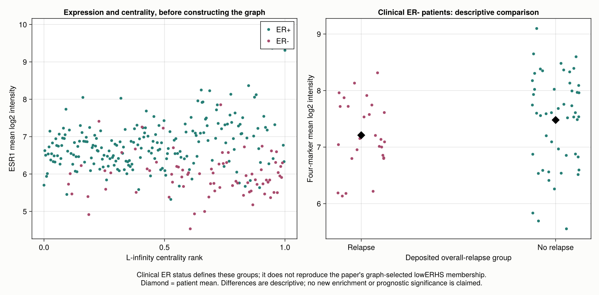

## The question behind the graph

The widely cited [paper by Lum et al. (2013)](https://doi.org/10.1038/srep01236)
illustrates Mapper with cancer expression data, congressional votes, and
basketball statistics. We concentrate on the public **GSE2034 breast cancer
cohort**, the independent dataset used in its cancer example. The reported
non-relapse network has a Y-shaped structure with a low-ESR1 arm; the authors
associate that arm with elevated chemokine expression.

Our result is a **partial reconstruction with the correct patient data**, not
an exact replication of the published graph. We recover low-ESR1 patients and a
descriptive chemokine-marker difference, but our reference graph is considerably
more fragmented. The experiment also exposes a methodological issue that matters
beyond this paper: when clinical outcome is a filter, outcome-pure graph regions
are partly imposed by the construction.

The earlier [Mapper chapter](../mapper.qmd) explains the algorithm. Here we focus
on what is needed to make a published application reproducible: the right
clinical table, explicit preprocessing, parameter translation, graph membership,
and a numerical comparison that does not depend on the drawing.

## Get the correct cohort and outcome

[GSE2034 at NCBI GEO](https://www.ncbi.nlm.nih.gov/geo/query/acc.cgi?acc=GSE2034)
contains **22,283 Affymetrix probe sets measured in 286 primary tumors** on
platform GPL96. We download the deposited processed expression matrix rather
than reprocessing CEL files. The original values are positive signal intensities,
with a range of **0.1 to 157,291.8**. Our analysis uses their base-two logarithms.

Three original files are needed:

| Original source | What we take from it |
|---|---|
| `GSE2034_series_matrix.txt.gz` | Probe identifiers, GSM sample identifiers, and expression intensities |
| `GSE2034_family.soft.gz` | The named *Patient clinical parameters* series table |
| `GPL96.annot.gz` | Probe-to-gene annotation, dated August 9, 2016 |

The acquisition script records full SHA-256 hashes in
[sources.toml](experiments/lum2013/data/sources.toml). The expression download
starts with `f6a99c62f0a29185`; the SOFT archive with `1fa927dc72870434`.
The locally retained [clinical table](experiments/lum2013/data/clinical.tsv)
is also hashed. These are identifiers of the actual downloaded bytes, not a
claim that GEO files will never change.

::: {.callout-important}
The current sample-level characteristic is **bone relapse**, which is not the
overall-relapse outcome used here. The overall-relapse indicator, follow-up time,
and clinical estrogen-receptor status are in the separate **series-level table**.
Its row order differs from the expression columns, so joining by row position
would assign outcomes to the wrong tumors.
:::

For example, the clinical table starts with `GSM36793`, whereas the expression
matrix starts with `GSM36777`. We enforce a one-to-one match on the complete GSM
identifiers and reorder the clinical records to match expression columns:

```julia
include("experiments/lum2013/scripts/common.jl")
data = load_data()  # verifies hashes, dimensions, IDs, positivity and labels

size(data.logexpr)       # (22283, 286): one patient per column
sum(data.relapse)        # 107
count(==("ER-"), data.er) # 77
```

The attached table has **179 patients without recorded relapse and 107 with
relapse**, including 50 and 27 clinical ER- patients respectively. Its clinical
ER totals are 209 ER+ and 77 ER-. GEO's narrative summary instead says 180 and
106. We retain the explicit patient-level table values and document that
discrepancy. A non-relapse label means no recorded event during the available
follow-up; it does not mean permanent survival.

## Published settings and explicit local substitutions

The paper specifies correlation distance and two filters. Its Figure 2 caption
reports centrality resolution 70, gain 3.0x, and equalization, with outcome
resolution 30 and gain 3.0x. [Supplementary Figure S1](https://media.springernature.com/original/springer-static/esm/art%3A10.1038%2Fsrep01236/MediaObjects/41598_2013_BFsrep01236_MOESM1_ESM.pdf)
gives 1,553 selected features for **NKI**, not an exact GSE2034 probe list.

| Pipeline ingredient | Local reference analysis | Replication status |
|---|---|---|
| Dataset | GSE2034; all 286 deposited samples | Correct public cohort |
| Expression input | `log2` of deposited positive intensities | Local preprocessing choice |
| Feature selection | Top 1,553 probe sets by sample variance | GSE2034 count/list not specified; exploratory transfer from NKI |
| Gene centering | None in the reference run | Additional centered runs are sensitivity checks |
| Pairwise distance | One minus Pearson correlation across selected probes | Matches the stated distance family |
| Centrality | Maximum distance from each patient to any other patient | Matches the stated formula |
| Equalization | Empirical centrality ranks in $[0,1]$ | Local approximation to software equalization |
| Cover | 70 centrality intervals, 30 outcome intervals | Published resolutions; endpoint convention local |
| Gain | Interpret 3.0x as interval width divided by step | Assumption: adjacent overlap is $2/3$ |
| Within-cell clustering | Single linkage, local first-empty-bin cutoff, 10 bins | Original software settings are not fully identified |
| Coloring | ESR1; separate four-marker mean | Annotation and marker aggregation are local |

The top features are **probe sets**, not 1,553 distinct genes. We rank all
deposited probe sets, including the ten controls in this reference selection;
we do not silently collapse probes to genes or standardize each gene to unit
variance. The exact selected list is saved in
[selected_probes.csv](experiments/lum2013/results/selected_probes.csv).

“Gain 3.0x” must not be passed into `Uniform(expansion=3.0)` and treated as a
documented equivalence. For our explicit convention, interval width $w$ and
step $s$ satisfy $w/s=3$, so adjacent overlap is $(w-s)/w=2/3$. On $[a,b]$,
with $k$ intervals, we use

$$
w=\frac{3(b-a)}{k+2},\qquad s=\frac{w}{3}.
$$

`gain_cover` creates those intervals through `ManualCover`. Closed endpoint
handling and empirical-rank equalization are specified by our code; they need
not coincide with the historical Ayasdi implementation.

## Build the geometry before building the graph

Let $A$ be the selected log-expression matrix, with one patient per column.
Subtract the mean of each patient column and normalize that column to unit
length. The dot product of two resulting columns is their Pearson correlation:

```julia
geometry = correlation_geometry(data; nprobes=1553, center_genes=false)

A = geometry.A
Z = A .- mean(A; dims=1)
Z ./= sqrt.(sum(abs2, Z; dims=1))
D = clamp.(1 .- Z' * Z, 0, 2)
D[diagind(D)] .= 0

centrality = vec(maximum(D; dims=1))
```

This is **Pearson distance**, not uncentered cosine distance. Centering each
patient column for Pearson correlation is also distinct from subtracting each
gene's mean across patients, which our sensitivity analysis optionally does.
One minus correlation need not satisfy the triangle inequality, so we use it
as the paper's pairwise dissimilarity and do not invoke metric-space guarantees.

Do not replace this maximal-distance centrality by `eccentricity(X)` from
MetricSpaces: that API averages distances. The published $L_\infty$ filter
requires their maximum.

The patient-to-patient matrix has only $286^2$ entries. We cache it and reuse
its submatrices during cover refinement. This avoids repeated calculations
over thousands of expression coordinates. A small adapter implements the
public JuliaTDA refiner interface:

```julia
struct CachedSingleLinkage <: TDAmapper.Refiners.AbstractRefiner
    distances::Matrix{Float64}
    bins::Int
end

function (r::CachedSingleLinkage)(ids::Vector{Int})
    length(ids) == 1 && return [1]
    local_D = r.distances[ids, ids]
    tree = Clustering.hclust(local_D; linkage=:single)
    cutoff = TDAmapper.Refiners.cutoff_at_first_empty_bin(
        tree.heights, maximum(local_D), r.bins)
    Clustering.cutree(tree; h=cutoff)
end
```

The full definition lives in `common.jl`; do not redefine the struct after
including that file. The integer vectors passed to the refiner identify
patients. Their numeric values are never used as scalar distances.

We now use the ordinary JuliaTDA cover, refinement, and nerve pipeline:

```julia
f = geometry.rank
cover = R2Cover(collect(zip(f, data.relapse)),
    gain_cover(f; resolution=70, gain=3.0),
    gain_cover(Float64.(data.relapse); resolution=30, gain=3.0))

refiner = CachedSingleLinkage(geometry.D, 10)
M = classical_mapper(collect(1:286), cover, refiner, SimpleNerve())

graph_summary(M, data)
```

Nodes represent locally clustered sets of tumors. Two nodes are joined exactly
when they share a patient. All 286 tumors appear in at least one node; a patient
can belong to several nodes because the intervals overlap.

## Actual numerical results

The script executes **54 prespecified configurations**: three feature counts
(500, 1,553, 3,212), three centrality resolutions (20, 35, 70), three histogram
counts (5, 10, 20), and two gene-centering choices. Gain stays at the declared
3.0 convention. The five exported reference/control graphs give:

| Configuration | Nodes | Edges | Components | Largest component, patients |
|---|---:|---:|---:|---:|
| Log2 only, 70 intervals | 371 | 559 | 37 | 112 |
| Log2 only, 20 intervals | 104 | 184 | 8 | 179 |
| Gene centered, 70 intervals | 419 | 632 | 40 | 47 |
| Gene centered, 20 intervals | 140 | 238 | 10 | 170 |
| Outcome-free control, log2 only, 70 intervals | 160 | 278 | 12 | 271 |

These component sizes count **unique patients**, not node memberships. The
reference 70-interval graph contains 215 singleton nodes; these are nodes with
one patient, not necessarily disconnected vertices. At 20 intervals, all 179
non-relapse patients lie in one connected component. Such merging makes the
coarser graph easier to inspect but does not certify the published Y shape.

{#fig-lum-mapper}

The local graphs show low-ESR1 regions, but the reference run does not recover
the published graph closely enough to identify its exact lowERHS arm. Node
placement is a visualization choice, and the dense overlaps generate triangles;
we do not interpret the cycle rank of the displayed graph as the first Betti
number of a fully filled nerve.

{#fig-lum-sensitivity}

The complete [sensitivity table](experiments/lum2013/results/sensitivity.csv)
is part of the result. Across the 54 configurations, the number of components
ranges from **2 to 131**, and the largest non-relapse component contains **14 to
179 patients**. It records alternatives instead of selecting a drawing that
happens to resemble the target.

## What does the expression annotation support?

The 2016 GPL96 annotation assigns **nine probe sets to ESR1**. We average their
log2 values for coloring. For the chemokine annotation, we average each gene's
probe values first, then weight the four named genes CCL13, CCL3, CXCL13 and
PF4V1 equally. These genes use five probe sets in total. The result is a
**four-marker descriptive score**, not the complete KEGG chemokine pathway
used in the publication.

Using the independently deposited clinical ER status gives:

| Clinical group | Patients | Mean ESR1 | Mean four-marker score |
|---|---:|---:|---:|
| All patients | 286 | 6.581 | 6.956 |
| ER-, relapse recorded | 27 | 5.958 | 7.210 |
| ER-, no relapse recorded | 50 | 5.982 | 7.479 |

All expression values in this table are means on the log2 intensity scale.
The ER- non-relapse group has a four-marker mean **0.269 higher** than the
ER- relapse group. This is directionally compatible with the reported example,
but the groups and score differ from the authors' definitions. It therefore
does not reproduce their pathway enrichment test or its significance.

{#fig-lum-diagnostics}

## Outcome is a filter, not a prediction

Our 30-interval binary cover cannot put outcomes 0 and 1 into the same cell.
Consequently every refined node is outcome-pure, and no edge can cross from a
relapse node to a non-relapse node. **Perfect separation of these labels is
guaranteed by the cover**, regardless of expression geometry.

We repeat the construction with one fixed random permutation of the 107
relapse indicators, preserving the total number of events. Nodes remain
outcome-pure. This control is not a statistical significance test: it exposes
the guaranteed separation. Removing the outcome lens produces mixed nodes and
a 271-patient largest component. The numerical control results are retained in
[outcome_control.csv](experiments/lum2013/results/outcome_control.csv).

This distinction leaves Mapper useful for exploring structure *within* clinical
groups. It prevents us from presenting a supervised construction as an
independent predictor of relapse. We also do not infer a survival advantage
from group means without a censoring-aware, independently validated analysis.

## Checks and how to rerun

The scripts verify hashes and sample alignment before analysis. For all five
exported graphs they check every potential nerve edge against membership
intersection and compare every local single-linkage partition with connected
components of an independently constructed distance-threshold graph. Cached
Pearson distances agree with `Statistics.cor` to at most $2.22\times10^{-16}$
on the checked pairs. All 54 configurations retain every patient. Repeated
numerical executions produced identical SHA-256 hashes for all 26 exported CSV
files; this verifies deterministic outputs for the recorded data and settings.

From the JuliaTDA workspace root:

```bash
python3 TDA_with_julia/reproductions/experiments/lum2013/scripts/download.py
julia --project=TDA_with_julia/reproductions/experiments/lum2013/environment \
  -e 'using Pkg; Pkg.instantiate()'
julia --startup-file=no \
  --project=TDA_with_julia/reproductions/experiments/lum2013/environment \
  TDA_with_julia/reproductions/experiments/lum2013/scripts/run.jl
```

The experiment uses a private environment with local JuliaTDA component paths;
it changes no shared book or package environment. Original compressed downloads
are ignored by Git and can be reacquired with the script. The environment,
extracted clinical table, selected probe identifiers, node memberships, numerical
tables, and precomputed figures are retained. The chapter itself performs no
network requests or computations when rendered.

[run_metadata.toml](experiments/lum2013/results/run_metadata.toml) records Julia
version, seed, Manifest hash, local package commit identifiers, dirty status,
source fingerprints, annotation probes, parameters and audits. Further details
are in the [experiment README](experiments/lum2013/README.md).

To move from this reconstruction to an exact replication, we would need the
historical GSE2034 analysis matrix and selected feature list, the original
equalization and clustering settings, graph-selected lowERHS membership, and
the full pathway scoring definition. The current result makes those gaps
visible while providing an executable analysis of the right cohort.
