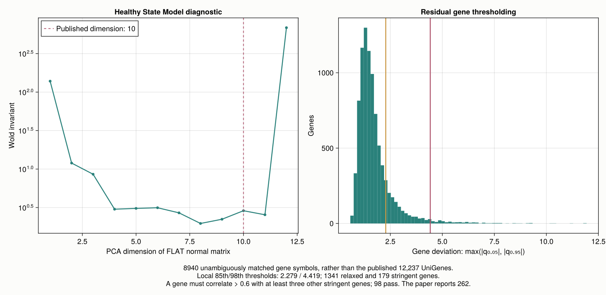
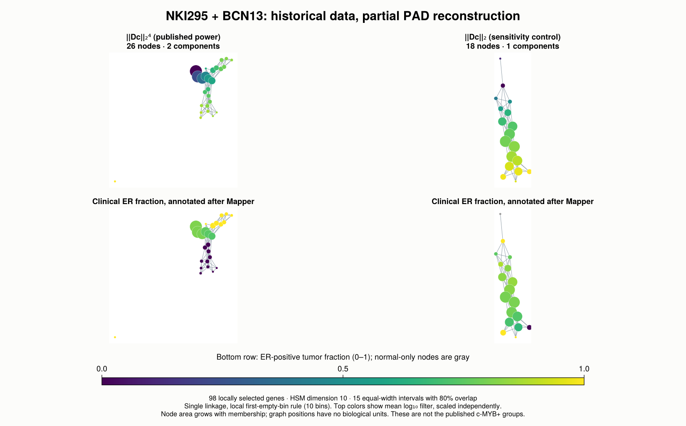
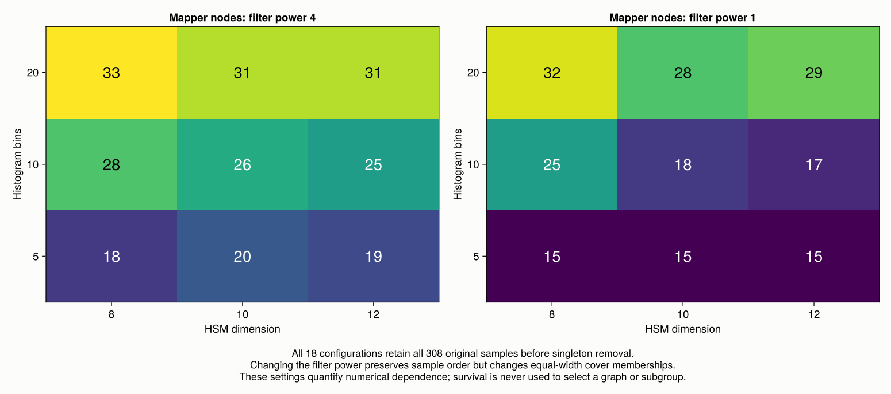

## What the published result asks us to reproduce

[Nicolau, Levine, and Carlsson (2011)](https://doi.org/10.1073/pnas.1102826108)
combined disease-specific genomic analysis (DSGA) with Mapper to study the
**NKI295 breast cancer cohort**. Their Progression Analysis of Disease (PAD)
represents a tumor by its departure from a model of healthy tissue. Mapper then
organizes those residual expression vectors by the magnitude of that departure.
The measurements are transcriptional microarray log ratios; this experiment
does not infer DNA mutations from them.

The paper identifies an ER-positive, c-MYB-high region containing 22 tumors,
or 14 when singleton bins are removed. It reports no recorded death or recurrence
in that selected group, with a median follow-up of 8.5 years. This is a statement
about observed follow-up in a retrospectively selected group, not a guarantee
of future survival. Clinical outcomes were examined after constructing PAD;
they were not filter coordinates.

Here we execute a **partial reconstruction on the correct NKI295 tumors and
archived BCN13 normal samples**. We rebuild FLAT, the Healthy State Model (HSM),
leave-one-out residuals, residual gene selection, and Mapper with JuliaTDA
components. The unavailable historical tumor-to-UniGene mapping requires an
explicit gene-symbol join. Consequently, our graph and gene list are not the
paper's graph and 262-gene list, and we do not label a local region as the
published c-MYB-positive subgroup.

## Recover the historical inputs

The data used here have two different origins. The tumor cohort is the
[van de Vijver et al. (2002) NKI295 study](https://doi.org/10.1056/NEJMoa021967).
The six original expression tables and original clinical spreadsheet are
preserved inside the Bioconductor
[seventyGeneData package](https://bioconductor.org/packages/seventyGeneData/).
Its [maintainer's vignette](https://bioconductor.posit.co/packages/3.19/data/experiment/vignettes/seventyGeneData/inst/doc/seventyGeneData.html)
documents the NKI source archives and separates this cohort from the earlier
van't Veer cohort. We use **all 295 van de Vijver patients**, not a combined
`breastCancerNKI` collection.

The normal reference was recovered from the
[public DSGA code repository associated with Reuten et al.](https://github.com/monkgroupie/publication_code),
which provides `NormalBreastData.zip` and Nicolau's DSGA R functions. The
[associated primary publication](https://doi.org/10.1038/s41563-020-00894-0)
links that repository. We pin commit
`2914487d9138dce2175f3a1e7918277187a11b87`. Its `BCN.ugc219.pcl` is a
preprocessed, complete matrix of **18,971 UniGene clusters and 13 samples**.
The archive also contains the original Stanford Microarray Database retrieval
report: the reported clone quality filters and 32,644 retained clones agree
with the 2011 supplement. This establishes a historical BCN13 reference, while
leaving a documented discrepancy in tissue-type counts.

::: {.callout-important}
The paper and supplement describe **nine nonneoplastic samples and four
reduction mammoplasties**. The recovered report and sample names identify
**ten `BC.N.*` samples and three `BC.NRm.*` samples**. We retain the exact
13 archived identifiers, rather than inventing a fourth mammoplasty or changing
a tissue label. Matching dimensions alone does not settle this discrepancy.
:::

The archived samples are `BC.N.031`, `.045`, `.047`, `.054`, `.058`, `.061`,
`.074`, `.076`, `.083`, `.140`, and `BC.NRm.146`, `.151`, `.156`.
The acquisition manifest records the full identifiers and SHA-256 hashes of
downloads and extracted files in
[sources.json](experiments/nicolau2011/data/sources.json).

| Input | Published target | Recovered artifact |
|---|---|---|
| Tumors | NKI295 | Six original NKI tables: 24,496 rows, including 17 controls |
| Assay feature universe | 24,479 identifiers | Independently checked against [GEO GPL2567](https://www.ncbi.nlm.nih.gov/geo/query/acc.cgi?acc=GPL2567) |
| Normal reference | BCN13, 18,971 UniGenes | Archived build-219 matrix, already imputed and collapsed |
| Clinical records | Original NKI patient table | `Table1_ClinicalData_Table.xls`, joined by `SampleID` |
| Tumor annotation | UniGene build 219 | Gene symbols preserved in `seventyGeneData`; historical UniGene mapping not recovered |

The original NKI values are **base-ten log ratios**, not positive intensities.
We multiply them by $\log_2(10)$ to convert to base-two log ratios. Calling
`log2` on the ratios themselves would be incorrect, including for negative
values. A zero flag denotes a control or bad measurement according to the
archive's README. We exclude the 17 platform controls, treat zero-flag entries
as missing, and require at least 70% valid entries per assay probe.

That rule leaves **24,453 probes**: 26 assay probes fail this flag criterion.
The supplement instead states that all 24,479 identifiers had at least 70%
data. The retained and rejected probe lists are saved, so this additional
preprocessing difference is inspectable. There are **36,476 missing values**
among the retained probes. Our deterministic, gene-oriented KNN imputation
uses ten complete donor genes, Euclidean distances over the target gene's
observed patients, and inverse-distance weights. The historical KNN partitioning,
weights, and random seed are not specified, so we do not claim identical
imputed values.

We mean-collapse tumor probes by their archived HUGO symbol, then join to
BCN symbols that identify exactly one UniGene cluster. Empty or ambiguous
normal symbols and unmatched tumor symbols are excluded; no alias guesses
or modern UniGene remapping are used. This yields **8,940 shared symbols**,
compared with the published **12,237 shared UniGenes**. Each row's tumor probes
and normal UniGene are recorded in
[gene_alignment.csv](experiments/nicolau2011/results/gene_alignment.csv).

Clinical records are aligned independently of this feature join:

```julia
include("experiments/nicolau2011/scripts/common.jl")
data = load_data()  # validates source hashes and one-to-one patient alignment

size(data.T)  # (8940, 295), base-two tumor log ratios after KNN and collapse
size(data.N)  # (8940, 13), matched historical normal reference
```

## Rebuild DSGA before drawing a graph

The [supporting information](https://pmc.ncbi.nlm.nih.gov/articles/instance/3084136/bin/1102826108_pnas.201102826SI.pdf)
fixes several details omitted from simplified accounts of PAD. Columns are
normalized to the mean Euclidean magnitude of the normal columns. FLAT replaces
each normal column by its no-intercept least-squares fit to the other normal
columns. Singular value decomposition then selects a **10-dimensional linear
Healthy State Model**. This follows
[Nicolau et al.'s DSGA method (2007)](https://doi.org/10.1093/bioinformatics/btm033).

If $U$ contains its ten orthonormal basis vectors, a normalized tumor column
$t$ is decomposed as

$$
N_c(t)=UU^\mathsf{T}t,\qquad D_c(t)=t-UU^\mathsf{T}t.
$$

This is a linear model through the origin. We do not center gene rows, add a
regression intercept, or apply PCA directly to the tumor cohort.

The FLAT step in our script is short enough to inspect:

```julia
function flat(N)
    F = similar(N)
    for j in axes(N, 2)
        other = N[:, setdiff(axes(N, 2), [j])]
        F[:, j] = other * (other \ N[:, j])
    end
    F
end

target = mean(norm.(eachcol(data.N)))
N = data.N .* (target ./ sqrt.(sum(abs2, data.N; dims=1)))
T = data.T .* (target ./ sqrt.(sum(abs2, data.T; dims=1)))
U = svd(flat(N); full=false).U[:, 1:10]
Dc = T - U * (U' * T)
```

The complete `dsga` function performs this normalization and returns both tumor components and
normal residuals:

```julia
result = dsga(data.T, data.N; r=10)
norm(result.T - result.Nc - result.Dc) / norm(result.T)  # numerical zero
norm(result.U' * result.Dc) / norm(result.Dc)            # numerical zero
```

Normal samples require a separate outer leave-one-out loop: omit normal $j$,
recompute FLAT and the rank-ten HSM from the remaining 12, and project the
held-out column. Projecting normal columns onto the full fitted model would
produce in-sample residuals and understate departure from the reference model.
We use those held-out residuals when placing the 13 controls into Mapper.

For feature selection, we compute each gene's
$\max(|q_{0.05}|,|q_{0.95}|)$ over the 295 tumor residuals. A gene must exceed
the 85th percentile of these deviations and correlate above 0.6 with at least
three other genes above the 98th percentile. We use Pearson correlation and
exclude self-correlation from that count; these implementation details are
explicit local conventions. Outcome does not enter the selection.

```julia
selection = select_genes(result.Dc)
A = hcat(result.L1, result.Dc)[selection.selected, :]
```

{#fig-nicolau-dsga width=100%}

## Construct Mapper with the published cover

The Figure 3 setting uses the filter
$f(v)=\lVert v\rVert_2^4$, **15 intervals**, and **80% overlap**. The filter
is evaluated on the selected residual genes, after concatenating normal
leave-one-out columns and tumor disease-component columns.

We use Pearson distance $1-\operatorname{cor}(v_i,v_j)$ between sample columns.
This centers each sample vector across its selected genes solely when computing
the correlation. It is distinct from mean-centering gene rows across patients,
and from uncentered cosine distance. The paper names correlation distance
without a complete numerical distance matrix; our precise convention is saved.

For an interval range $[a,b]$, resolution $n$, and overlap $\alpha$, our cover has
width and step

$$
w=\frac{b-a}{n-(n-1)\alpha},\qquad s=(1-\alpha)w.
$$

Thus $n=15$ and $\alpha=0.8$ give a width spanning $1/3.8$ of the filter range.
We use equal-width intervals in the **untransformed numerical filter range**,
without rank equalization. Endpoint inclusion is explicit in `interval_cover`.

```julia
G = geometry(A)             # cached 308 × 308 Pearson-distance matrix
model = mapper(G; k=4, resolution=15, overlap=0.8, bins=10)

summary(model)
```

The original local clustering parameters are not identified by the available
article and supplement. Our declared substitute uses single linkage and the
JuliaTDA first-empty-bin cutoff with ten histogram bins over each cover cell's
distance diameter. An adapter passes the cached distance submatrix to
`Clustering.hclust`; integer sample indices are identifiers, not scalar
coordinates. `TDAmapper.classical_mapper` builds the cover clusters and their
intersection nerve. `TDAplots.layout_spring` supplies a seeded drawing; it does
not decide graph edges.

{#fig-nicolau-mapper width=100%}

## Compare numerical results without selecting a favorable subgroup

The published and local pipelines differ before Mapper, so visual similarity
would not establish that the same patients form the same subgroup. We report
graph membership and diagnostics, rather than selecting a red region by eye
and testing whether its observed survival happens to be favorable.

| Checkpoint | Published analysis | Executed local result |
|---|---|---|
| Tumors / controls | 295 / 13 | 295 / 13 |
| Shared feature rows | 12,237 UniGenes | 8,940 unique matched symbols |
| HSM dimension | 10 | 10; additionally checked at 8 and 12 |
| Selected residual genes | 262 | 98 |
| Figure 3 cover | 15 intervals, 80% overlap | Same declared interval count and overlap |
| Nodes / edges / components | Exact graph table unavailable | 26 / 89 / 2 |
| Covered samples before pruning | Normal and tumor cohort | All 308 |
| Singleton-pruned coverage | 14 versus 22 c-MYB-positive tumors | 307 of 308 samples retained; no c-MYB-positive assignment |
| Published subgroup survival | No recorded events; median follow-up 8.5 years | Not independently reproduced |

The reference graph contains four singleton nodes; its largest component
contains **307 samples**. Removing every singleton node leaves **22 nodes,
78 edges, one component, and 307 samples**; only `Sample 282` loses all
memberships. These 22 nodes are not the published 22 tumors: graph vertices
represent overlapping groups of samples, and the two counts have different
meanings. The power-one control has **18 nodes, 59 edges, and one component**
covering all 308 samples.

The local relaxed and stringent thresholds are **2.279 and 4.419**, giving
1,341 and 179 candidate genes respectively. The supplement reports thresholds
about 2.21 and 4.25, with 1,836 and 245 genes. Similar numerical thresholds
do not establish identical expression matrices: the eligible gene universe
and correlation neighborhoods differ, and our final 98-gene selection is
considerably smaller than 262.

The HSM projection satisfies the relative orthogonality check to
**$2.08\times10^{-16}$**; reconstructing `Nc + Dc` gives zero residual at the
stored floating-point precision. The Wold diagnostic has a small local rise
at dimension 10 and a much larger value at 12. We use 10 because it is the
published setting, rather than claiming that the recovered gene subset
independently establishes the same dimension choice. The median full matched-gene
residual norm is **38.95 for held-out normals and 108.27 for tumors**.
The median selected-gene filter is **575.09 versus 275,669.45**. These are
descriptive properties of this aligned dataset, not calibrated disease scores.

{#fig-nicolau-sensitivity width=100%}

The 18 prespecified configurations combine HSM dimensions 8, 10, and 12;
filter powers 1 and 4; and first-empty-bin histograms with 5, 10, and 20 bins.
All keep the same original patients and the same 15-interval, 80%-overlap cover
convention. Every configuration covers all 308 samples before pruning.

Raising a positive filter to the fourth power preserves patient ordering but
does **not** preserve equal-width interval memberships. This is why changing
only the power can materially change graph connectivity. Likewise, the cycle
rank of this graph is a graph statistic: with 80% overlap, higher-order nerve
simplices may fill its apparent loops. We do not interpret it as the first Betti
number of the underlying expression space.

The original clinical table is retained in
[clinical.tsv](experiments/nicolau2011/data/clinical.tsv), and the patient-level
residuals, MYB and ESR1 values, clinical ER labels, and observed follow-up are in
[samples.csv](experiments/nicolau2011/results/samples.csv). Their presence enables
inspection and future comparison if the historical subgroup IDs are recovered.
They are not inputs to FLAT, HSM selection, gene thresholds, distances, or Mapper.
The full cohort has 226 ER-positive tumors and 79 recorded deaths, with a
median observed survival/follow-up time of 7.225 years. This whole-cohort
description does not test the paper's c-MYB-positive survival claim.

## Rerun and inspect the evidence

The chapter embeds precomputed figures and uses static Julia fences. It renders
without downloads or computation. From the JuliaTDA workspace root:

```bash
# Optional: recover the ignored large archives and rebuild checked-in inputs.
# Requires Python 3, R and readxl; the analysis itself uses Julia.
python3 TDA_with_julia/reproductions/experiments/nicolau2011/scripts/prepare.py

# On a fresh machine, instantiate only this private environment.
JULIA_PKG_PRECOMPILE_AUTO=0 julia \
  --project=TDA_with_julia/reproductions/experiments/nicolau2011/environment \
  -e 'using Pkg; Pkg.instantiate()'

JULIA_PKG_PRECOMPILE_AUTO=0 julia \
  --compiled-modules=existing --pkgimages=existing \
  --project=TDA_with_julia/reproductions/experiments/nicolau2011/environment \
  TDA_with_julia/reproductions/experiments/nicolau2011/scripts/run.jl
```

The private Manifest uses relative paths to the local JuliaTDA components. It
imports `TDAmapper` and `TDAplots` directly, alongside scientific dependencies.
The raw archives are ignored; their download URLs and full hashes are retained.
The small derived inputs are checked before analysis. Add `--no-plots` for a
numerical rerun. A clean machine must first instantiate the private environment.

The saved [run metadata](experiments/nicolau2011/results/run_metadata.toml)
records the Manifest, input and script hashes, Julia version, local source-tree
fingerprints, package Git revisions and dirty state. **All twelve numerical
integrity checks passed**, alongside the full graph and distance audits. They verify
patient alignment, finite expression values, normalized column magnitudes,
orthogonal DSGA components, nonzero held-out normal residuals, complete coverage,
all nerve edges, Pearson distances against `Statistics.cor`, and local single
linkage against independently computed threshold connected components.
Two separate Julia processes repeated KNN, DSGA and all 18 Mapper settings;
**all 14 numerical CSV outputs were byte-identical**. Their SHA-256 hashes are
recorded in [determinism.toml](experiments/nicolau2011/results/determinism.toml).

The main limits are concrete: the original NKI UniGene-219 mapping and original
local clustering choices were not recovered; the normal tissue-type counts
disagree across the text and archived labels; and our flag/KNN conventions are
fully specified substitutes. The `Dataset S1` matrix named in the supplement
was not available among the recovered PMC attachments. We therefore cannot
verify the historical 262-gene membership or a one-to-one match of the published
c-MYB-positive patient group. These gaps bound what this executed reconstruction
can establish.
