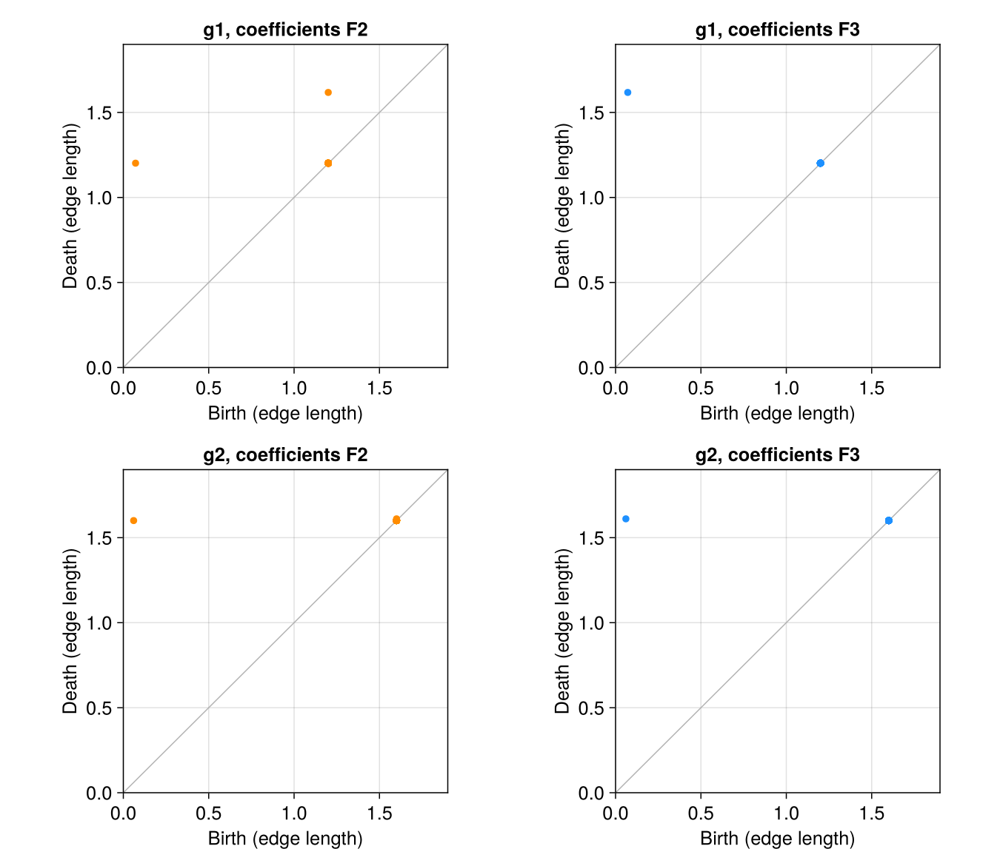

---
execute:
  enabled: false
---

# Perea and Harer (2015): sliding windows, periodicity, and coefficients {#sec-reproduction-perea-harer}

Can persistent homology distinguish the shape of an oscillation from the strength of its periodicity? [Perea and Harer, *Sliding Windows and Persistence: An Application of Topological Methods to Signal Analysis*](https://doi.org/10.1007/s10208-014-9206-z), published in *Foundations of Computational Mathematics* **15**, 799–838 (2015), connects this question to the geometry of delay embeddings. A periodic signal becomes a closed curve in a higher-dimensional space, and its longest $H_1$ bar measures how strongly that curve persists through the Vietoris–Rips filtration.

Here we reproduce the two explicitly specified signals in **Section 6.3 and Figure 3 of [arXiv:1307.6188v2](https://arxiv.org/html/1307.6188v2#S6.SS3)**. The distinctive result is that the coefficient field can change the answer even for an ordinary scalar periodic signal. Our computations recover that effect. They also expose a numerical disagreement with the published figure, which we keep visible rather than conceal by tuning parameters.

::: {.callout-note title="What was reproduced?"}
This is a reproduction of a fully specified synthetic experiment and several associated geometric checks. There is no observational dataset to download for this target: its correct data are the paper's two formulas evaluated at its stated sample times. We save those evaluations and their sliding windows as CSV files. The noise and window sweeps below are our own diagnostic extensions; they do not reproduce the separate classification experiment in Section 7.
:::

## The published target

The paper gives

$$
g_1(t)=0.6\cos(t)+0.8\cos(2t),\qquad
g_2(t)=0.8\cos(t)+0.6\cos(2t).
$$

Both have period $2\pi$ and the same total squared harmonic amplitude. Their difference is which harmonic dominates. The stated experiment uses

$$
M=4,\qquad \tau=\frac{2\pi}{5},\qquad
T=\left\{\frac{2\pi k}{150}:k=0,\ldots,150\right\}.
$$

A window has $M+1=5$ coordinates,

$$
SW_{M,\tau}g(t)=\big(g(t),g(t+\tau),\ldots,g(t+M\tau)\big),
$$

and spans $M\tau=8\pi/5$, or **0.8 of a period**. Confusing $M$ with the number of coordinates changes the experiment. So does replacing $M\tau$ by a full period.

For every window $x$, the authors subtract its coordinate mean and normalize its Euclidean length:

$$
C(x)=x-\frac{1}{5}\left(\sum_{j=1}^{5}x_j\right)\mathbf 1,
\qquad z=\frac{C(x)}{\|C(x)\|_2}.
$$

This is normalization **within each window**, not standardization of the five coordinates across the entire dataset. We then compute $H_1$ with coefficients in $\mathbb F_2$ and $\mathbb F_3$, using the Euclidean Vietoris–Rips filtration. Its scale is the maximum **edge length** of a simplex, exactly the convention in Section 3 of the paper.

The source includes $t=0$ and $t=2\pi$. We retain both, giving 151 windows and 150 distinct phases. Their distance is below $4\times10^{-16}$ in floating-point arithmetic. The periodically repeated endpoint is documented rather than silently discarded.

## Recreate the signals and compute the diagrams

The local stack supplies `MetricSpaces`, `TDARipserer`, `TDAPersistenceDiagrams`, and `TDAplots`. Columns of the following matrix are points:

```julia
using MetricSpaces, TDARipserer, TDAPersistenceDiagrams, TDAplots
using Statistics
import LinearAlgebra: norm

times = 2π .* collect(0:150) ./ 150
M, τ = 4, 2π / 5
signals = [t -> 0.6cos(t) + 0.8cos(2t),
           t -> 0.8cos(t) + 0.6cos(2t)]

function normalized_windows(f, times, M, τ)
    X = [f(t + j * τ) for j in 0:M, t in times]
    X .-= mean(X; dims=1)
    radii = sqrt.(sum(abs2, X; dims=1))
    minimum(radii) > 1e-12 || error("Constant window")
    return X ./ radii
end

Z = normalized_windows(signals[1], times, M, τ)
cloud = EuclideanSpace(Z)
F2 = ripserer(Rips(cloud; threshold=Inf); dim_max=1, modulus=2)
F3 = ripserer(Rips(cloud; threshold=Inf); dim_max=1, modulus=3)

maximum(persistence, F2[2]), maximum(persistence, F3[2])
# (1.1300471651756057, 1.5460186896838193)

barcode_plot(F3[2])
```

We explicitly allow the full filtration with `threshold=Inf` and verify that all returned $H_1$ bars have finite deaths. A truncated filtration can otherwise turn an unfinished bar into an apparent strong periodicity result.

Following the paper, we report

$$
mp(D)=\max_{(b,d)\in D}(d-b),\qquad
\operatorname{Score}(g)=\frac{mp(D)}{\sqrt 3}.
$$

The $\sqrt3$ denominator comes from the death scale of the unit circle in the Euclidean Rips filtration. It does not make the score a probability or provide a significance threshold.

## Results: changing the field changes the longest bar

The following values were computed from the saved windows, without tuning their amplitudes, delay, or sample times:

| Signal | Field | Longest birth | Longest death | Maximum persistence | Score |
|:--|:--|--:|--:|--:|--:|
| $g_1$ | $\mathbb F_2$ | 0.071559 | 1.201606 | 1.130047 | 0.652433 |
| $g_1$ | $\mathbb F_3$ | 0.071559 | 1.617578 | 1.546019 | 0.892594 |
| $g_2$ | $\mathbb F_2$ | 0.060398 | 1.600438 | 1.540040 | 0.889143 |
| $g_2$ | $\mathbb F_3$ | 0.060398 | 1.610676 | 1.550278 | 0.895053 |

{#fig-perea-coefficients width=90%}

For $g_1$, changing from $\mathbb F_2$ to $\mathbb F_3$ increases maximum persistence by **0.415972**, approximately **36.8%**. Over $\mathbb F_2$, the initial loop dies near 1.2 and another loop, born near 1.2, survives until 1.617578. Over $\mathbb F_3$, one class survives across that transition. For $g_2$, the change in maximum persistence is much smaller: **0.010238**, approximately **0.7%**.

The paper explains the pronounced $g_1$ effect through a Möbius strip that appears as more cross-window edges enter the filtration. Its boundary behaves differently over characteristic two and an odd characteristic. This is a concrete reason to record the coefficient field when reporting a periodicity score. A pipeline that always uses the default `modulus=2` can miss the stronger persistence visible over $\mathbb F_3$.

{#fig-perea-barcode width=75%}

### How close are we to the original Figure 3?

**The qualitative coefficient effect agrees; the plotted numerical endpoints do not all agree.** The [original figure](https://arxiv.org/html/1307.6188v2/FunctionVsDiagramTDA.png) puts the principal $g_1$ death over $\mathbb F_3$ near 1.56 and the principal $g_2$ deaths near 1.47. We obtain 1.617578 and approximately 1.60–1.61. Its secondary $g_1$ birth over $\mathbb F_2$ appears near 0.76, whereas ours is 1.2. These source values are approximate readings from the image, not numerical data supplied by the authors.

This discrepancy is larger than floating-point error. Our implementation follows the formulas and parameters stated in Section 6.3; it does not establish that the published raster was generated with precisely those settings. Without the figure's original numerical output or executable implementation, the cause remains unresolved. The correct status is therefore **parameter-faithful computation with a qualitative reproduction of Figure 3**, not an exact recovery of its plotted coordinates.

## Check the geometry independently

At $M=4$ and $\tau=2\pi/5$, the normalized window cloud for

$$
g(t)=r_1\cos(t)+r_2\cos(2t),\qquad r_1^2+r_2^2=1,
$$

is isometric to the following explicit four-dimensional curve:

$$
\widetilde z(t)=
\big(r_1\cos t,r_1\sin t,r_2\cos2t,r_2\sin2t\big).
$$

This provides a strong check on the window construction without reducing its dimension by PCA or changing the distances:

```julia
r1, r2 = 0.6, 0.8
Z4 = permutedims(hcat(r1 .* cos.(times), r1 .* sin.(times),
                      r2 .* cos.(2 .* times), r2 .* sin.(2 .* times)))

D1 = [norm(Z[:, i] - Z[:, j]) for i in eachindex(times), j in eachindex(times)]
D2 = [norm(Z4[:, i] - Z4[:, j]) for i in eachindex(times), j in eachindex(times)]
maximum(abs, D1 - D2)
# 1.609823385706477e-15

H1_4d = ripserer(Rips(EuclideanSpace(Z4); threshold=Inf);
                dim_max=1, modulus=3)[2]
Bottleneck()(F3[2], H1_4d)
# 4.440892098500626e-16
```

For $g_2$, the largest pairwise-distance discrepancy is $1.39\times10^{-15}$, and the bottleneck discrepancy is also $4.44\times10^{-16}$. The raw five-coordinate windows have constant radius $\sqrt{5/2}$, as expected from the orthogonal harmonic decomposition. After normalization, their norms differ from one by at most $2.22\times10^{-16}$.

Passing the directly computed distance matrix to `Rips` also recovers all four diagrams within numerical precision. In addition, `crosscheck.jl` obtains exactly the same principal bar endpoints using both `alg=:cohomology` and `alg=:homology`. These checks exercise different inputs and reduction modes inside `TDARipserer`; they do **not** constitute a comparison against an independent persistence implementation.

We also replace $g_1$ by $3.2g_1+7$. Centering removes the constant, and unit normalization removes the positive amplitude multiplier. The resulting $H_1$ bottleneck distance is **$2.22\times10^{-16}$**. Thus the contrast between the two signals is not a difference in units or offset.

### Test the paper's finite-sampling bound

Theorem 6.8 concerns a Fourier cutoff $N$ and a prime coefficient field $p>N$. Here the two signals are already trigonometric polynomials with $N=2$, so **$p=3$ meets the hypothesis and $p=2$ does not**. For these amplitudes, the bound becomes

$$
mp(D)\geq\sqrt3\max(r_1,r_2)
-\delta\,2\sqrt2\sqrt{r_1^2+4r_2^2}.
$$

The sample phases have Hausdorff radius $\pi/150$ on the circle; the script chooses $\delta=(1+10^{-10})\pi/150$ to satisfy the theorem's strict density inequality. The lower bounds are **1.284414** for $g_1$ and **1.300206** for $g_2$. Their computed $\mathbb F_3$ maximum persistences exceed these bounds by 0.261605 and 0.250072.

The $\mathbb F_2$ value for $g_1$, 1.130047, is below the corresponding expression. This is not a counterexample to the theorem: its field hypothesis excludes that computation.

## A cosine reference with known endpoints

Section 2.1 derives the sliding-window ellipse for $f(t)=\cos(Lt)$. At $L=1$ and our resonant delay, its centered, unit-normalized windows form a unit circle. Sampling $n$ equally spaced distinct phases gives a regular $n$-gon. For the sample sizes below, all divisible by three, its longest Rips bar has

$$
b_n=2\sin(\pi/n),\qquad d_n=\sqrt3.
$$

| Distinct windows | Computed birth | Computed death | Score |
|--:|--:|--:|--:|
| 30 | 0.209057 | 1.732051 | 0.879301 |
| 60 | 0.104672 | 1.732051 | 0.939568 |
| 150 | 0.041885 | 1.732051 | 0.975818 |
| 300 | 0.020944 | 1.732051 | 0.987908 |

Every endpoint agrees with this analytic reference within $9.89\times10^{-15}$. A perfectly periodic signal still has a score below one at finite sample density, because its loop is born after zero. The convergence table is therefore a useful check on both the persistence engine and the interpretation of the score.

## Sensitivity and controls

Our extensions vary the delay through 15 ratios of $2\pi/5$, retaining $M=4$, the original 151 sample times, and $\mathbb F_3$. The normalized mixture scores do **not** have their global maximum at the published delay: $g_1$ reaches 0.926034 at a window of 0.32 periods, and $g_2$ reaches 0.896161 at 0.24 periods, compared with their published-window scores 0.892594 and 0.895053. The near-period window has a clear theoretical justification, but this finite experiment does not justify treating it as the unique optimum for every signal.

For the pure cosine, we separately retain the *unnormalized ellipse geometry* from Section 2.1, dividing all windows by the same factor $\sqrt{5/2}$. Per-window unit normalization would remove that radial geometry. The squared axes are

$$
a_{\pm}^2=1\pm\frac{1}{5}
\left|\frac{\sin(5\tau)}{\sin\tau}\right|.
$$

Their direct Gram-matrix eigenvalues agree with this formula within $4.44\times10^{-16}$. Equal axes occur at several resonances, including window fractions 0.4 and 0.8, so even a pure cosine need not yield a unique period estimate from a window sweep alone.

{#fig-perea-sensitivity width=100%}

For an ordering control, we sample $g_1$ at 271 equally spaced times and randomly permute those observations. A second control generates 271 independent Gaussian observations. Each produces 151 ordinary, nonwrapping windows with coordinate lag 30, the discrete equivalent of $\tau=2\pi/5$. This matches the number of windows and coordinates while avoiding an artificial cyclic closure of the noise sequence.

| Control, ten seeds | Median score | Minimum | Maximum |
|:--|--:|--:|--:|
| Permuted observations of $g_1$ | 0.208367 | 0.181475 | 0.268343 |
| Independent Gaussian observations | 0.203134 | 0.173529 | 0.218770 |

Both controls fall well below the two original $\mathbb F_3$ scores. This supports the importance of ordered oscillatory structure in this example. Ten realizations do not establish a classifier's sensitivity, specificity, or a generally valid significance cutoff. Overlapping windows are also dependent observations.

## Reproducibility and remaining limits

The complete experiment is [available with its configuration and saved results](experiments/perea-harer2015/README.md). From the JuliaTDA workspace root:

```bash
julia --startup-file=no TDA_with_julia/reproductions/experiments/perea-harer2015/setup.jl
julia --startup-file=no --project=TDA_with_julia/reproductions/experiments/perea-harer2015/environment TDA_with_julia/reproductions/experiments/perea-harer2015/run.jl
```

The private environment follows local JuliaTDA components and records their Git revisions, source hashes, the Julia version, and Project/Manifest hashes. Setup may download dependencies on a fresh machine; the analysis generates its data locally and needs no network. Figures and CSV tables are precomputed, and the chapter's Julia examples are static, so rendering the chapter does not rerun the experiment.

The run passes **39 scientific consistency checks**, covering centering, norms, harmonic isometry, distance-matrix input, affine invariance, ellipse axes, known polygon endpoints, and the applicable persistence lower bounds. Two full runs produce byte-identical published-target summary CSV files; the reduction-mode crosscheck also passes. We preserve all positive-length $H_1$ intervals, including short bars near the diagonal, rather than reporting only the longest one.

Our strongest reproduced findings are the coefficient-sensitive $g_1$ example, the geometric equivalence of its window embedding, and the cosine persistence benchmark. The original Figure 3 coordinate mismatch remains unresolved. We have not reproduced cubic-spline preprocessing, the Section 7 noise classification rates, comparisons against JTK_CYCLE or Lomb–Scargle, or any gene-expression analysis. Those require a separate, precisely specified experiment before extending the reproduction claim.
