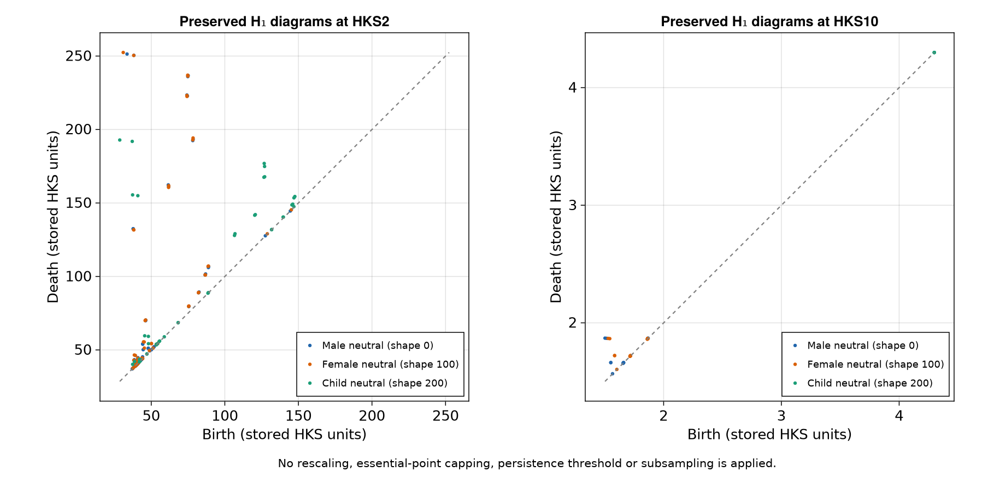
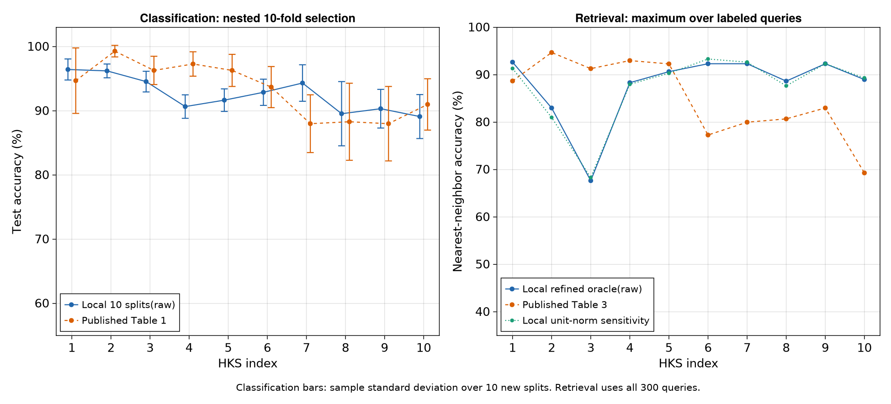
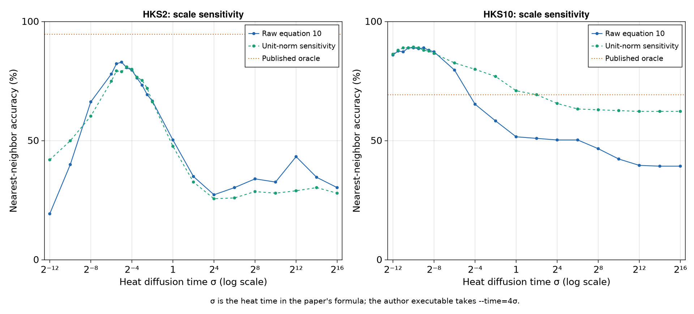

## Reconstructing the SHREC14 benchmark {#sec-reproduction-reininghaus2015}

Using preserved SHREC14 diagrams, our local kernel and SVM pipeline reaches
**96.22 ± 1.07%** classification accuracy at HKS $t_2$ and **89.11 ± 3.43%** at
$t_{10}$. The corresponding published values are 99.3 ± 0.9% and 91.0 ± 4.0%.
Classification is reasonably close across several settings, while the
nearest-neighbor retrieval table has substantial discrepancies. This chapter
records a completed empirical reconstruction with those discrepancies intact.

The target is Jan Reininghaus, Stefan Huber, Ulrich Bauer and Roland Kwitt's
[**A Stable Multi-Scale Kernel for Topological Machine Learning**, CVPR 2015,
pp. 4741–4748](https://openaccess.thecvf.com/content_cvpr_2015/papers/Reininghaus_A_Stable_Multi-Scale_2015_CVPR_paper.pdf).
We reconstruct its synthetic SHREC 2014 experiments: 300 human meshes, 15
identities, 20 poses each, and ten HKS filtrations. Tables 1 and 3 evaluate finite
$H_1$ diagrams using kernel SVMs and nearest-neighbor retrieval, respectively.

## Recovering the correct data

The original [persistence-learning repository](https://github.com/rkwitt/persistence-learning)
contains an annuli demonstration and an OASIS processing example associated
with a later NIPS paper. Those examples do not supply the CVPR SHREC benchmark.
An attempted download of the original Outex texture archive failed because its
official hostname did not resolve; we therefore selected SHREC's preserved
diagrams rather than substituting another texture dataset.

The provenance chain is unusually useful. Section 8.4 of
[Perea, Munch and Khasawneh's 2019 preprint](https://arxiv.org/html/1902.07190v2#S8.SS4)
describes using the same 300 pairs of SHREC diagrams at ten HKS parameters.
Its acknowledgments credit Ulrich Bauer for providing that dataset. The
[`Uli_data.csv` redistribution](https://github.com/lucho8908/adaptive_template_systems/blob/3e217d151d09e5eed213f927960986854331c148/Examples/Shapes/Uli_data/Uli_data.csv)
and the accompanying
[notebook](https://github.com/lucho8908/adaptive_template_systems/blob/3e217d151d09e5eed213f927960986854331c148/Examples/Shapes/Uli_data/UliShapeData.ipynb)
preserve all ten settings and explicitly map IDs to the 15 identities.

We downloaded that CSV at commit `3e217d151d09e5eed213f927960986854331c148`.
Its SHA256 is:

```text
80cfce72ee053ffac2ee82e7358118bc43907930262b795ef443460a3abcd042
```

The CSV names are misleading: `freq` is the zero-based shape ID, and `trial`
is the HKS setting index 1–10. The identity is `fld(freq,20)+1`. Consecutive
blocks correspond to male, female and child identities, with neutral,
bodybuilder, fat, thin and average body shapes within each group. This is
classification of individual body models across poses, not a three-class
sex/age problem.

The file has 210,816 records. Selecting `dim == 1` retains 152,892 finite $H_1$
records; 5,576 have equal birth and death after CSV rounding and contribute
exactly zero to our kernel. We keep **all 147,316 positive-lifetime pairs**,
without a persistence cutoff or subsampling. Negative dimension codes mark
essential features: 9,290 such records across both homology dimensions are
excluded, matching the original executable's dimension selection. Their
stored death coordinates are finite caps and must not be interpreted as
genuine deaths. At $t_{10}$, rounding leaves 17 diagrams empty.

We start after filtration and persistence computation. Numerical HKS times,
mesh preprocessing, full-precision diagrams and the original random splits
are not reconstructed from this CSV. The indices $t_i$ identify preserved
settings, not known numerical heat times. Coordinate units remain exactly
those of the stored HKS values; there is no per-diagram rescaling.

{#fig-reininghaus-diagrams}

## Evaluating the local kernel

For finite diagrams $F, G$, the scale-space kernel is

$$
k_\sigma (F, G)=\frac{1}{8\pi\sigma}
\sum_{p\in F}\sum_{q\in G}
\left[
e^{-\|p-q\|^2/(8\sigma)}-
e^{-\|p-\bar q\|^2/(8\sigma)}
\right],\qquad \bar q=(q_2, q_1).
$$

Here `sigma` is a **heat diffusion time**, with squared coordinate units;
it is not a Gaussian standard deviation. In the primary run we use
`TDAPersistenceDiagrams.PersistenceScaleSpaceKernel` directly, including
the factor $1/(8\pi\sigma)$. Its stable `expm1` evaluation preserves the
difference between the two exponentials for points close to the diagonal.
Threading changes how matrix entries are scheduled, without approximating
the kernel.

An audit of the author's `diagram_distance.cpp` found another convention:
its command-line `--time T` evaluates exactly $k_{T/4}$. Thus a comparison
with our kernel requires **`T = 4sigma`**. The four signed reflected-point
terms and the half-plane prefactor give the same kernel, without an extra
normalization constant. Passing the same numerical parameter to both
implementations would compare different diffusion scales.

The following runnable snippet uses the actual $t_2$ diagrams. Run it from
the monorepo root with the private environment described below.

```julia
using TDAPersistenceDiagrams, LIBSVM, DelimitedFiles
experiment = abspath("TDA_with_julia/reproductions/experiments/reininghaus2015")
include(joinpath(experiment, "common.jl"))
data = load_data() # verifies the pinned SHA256

# Reuse the audited winner selected solely by inner CV in outer split1.
scores = readdlm(joinpath(RESULTS, "classification.csv"), ',', Float64;
                 header=true)[1]
chosen = scores[findfirst((scores[:,1] .== 2) .& (scores[:,2] .== 1)), :]
splits = readdlm(joinpath(RESULTS, "splits.csv"), ','; header=true)[1]
train = Int.(splits[(splits[:,1] .== 1) .&
                   (splits[:,4] .== "train"), 2]) .+ 1
test = Int.(splits[(splits[:,1] .== 1) .&
                  (splits[:,4] .== "test"), 2]) .+ 1

kernel = PersistenceScaleSpaceKernel(sigma=chosen[3])
K = Matrix(kernel_matrix(kernel, data.diagrams[2]))
model = svmtrain(K[train,train], data.labels[train];
                 kernel=LIBSVM.Kernel.Precomputed, cost=chosen[4], nt=1)
predicted, _ = svmpredict(model, K[train,test]; nt=1)
@assert count(predicted .== data.labels[test]) == Int(chosen[7])
```

## Matching the evaluation protocol

Our classification run uses ten new stratified 70/30 splits: 14 training and 6
test examples per identity, hence 210 train and 90 test shapes. Seed 20150315
and the complete split manifest are saved. Every HKS setting uses the same
outer splits. Within each training set, a fixed stratified ten-fold partition
selects both parameters; the outer test labels never enter that selection.

The locally specified grids are

```julia
SIGMAS = 2.0 .^ (-12:2:16) #15 heat times
COSTS  = 2.0 .^ (-5:2:15)  #11 SVM costs
```

For each candidate, we accumulate its 210 held-out training predictions.
Ties select the smallest `sigma`, then the smallest `C`. The winning model
is fitted to all 210 training examples and evaluated once on the 90 test
examples. We evaluate all ten preserved HKS settings; none is selected by
its outer test accuracy. This required 165,000 inner SVM fits across 100 outer
evaluations. The original search grids and random seeds were not released,
so these are explicit reconstruction choices. Some inner-CV winners reach
the upper cost boundary; the finite search range remains a limitation.

Retrieval uses the squared RKHS distance
$k (F, F)+k (G, G)-2 k (F, G)$, excludes the query itself, and ranks the other 299
shapes. Table 3 reports the best nearest-neighbor accuracy over a scale
range. We therefore report an **oracle maximum on all 300 labeled queries**,
not a held-out accuracy estimate. After the coarse search, a separate
retrieval-only step adds half-power scales within ± 1.5 units on the log₂ scale around each
coarse winner. These refined scales never enter the SVM search. Exact ties
are resolved by source shape ID.

## Actual results

The primary results use the unnormalized kernel. Classification values below
are mean ± sample standard deviation over ten local splits; nearest-neighbor
values are the refined oracle percentage. Published entries come from
Tables 1 and 3 of the CVPR paper.

| HKS | Published SVM (%) | Local SVM (%) | Published NN (%) | Local NN (%) |
|:---:|---:|---:|---:|---:|
| $t_1$ |94.7 ± 5.1 |96.44 ± 1.64 |88.7 |92.67 |
| $t_2$ |99.3 ± 0.9 |96.22 ± 1.07 |94.7 |83.00 |
| $t_3$ |96.3 ± 2.2 |94.56 ± 1.61 |91.3 |67.67 |
| $t_4$ |97.3 ± 1.9 |90.67 ± 1.83 |93.0 |88.33 |
| $t_5$ |96.3 ± 2.5 |91.67 ± 1.76 |92.3 |90.67 |
| $t_6$ |93.7 ± 3.2 |92.89 ± 2.04 |77.3 |92.33 |
| $t_7$ |88.0 ± 4.5 |94.33 ± 2.84 |80.0 |92.33 |
| $t_8$ |88.3 ± 6.0 |89.56 ± 5.00 |80.7 |88.67 |
| $t_9$ |88.0 ± 5.8 |90.33 ± 3.01 |83.0 |92.33 |
| $t_{10}$ |91.0 ± 4.0 |89.11 ± 3.43 |69.3 |89.00 |

{#fig-reininghaus-benchmark}

The largest classification differences are −6.63 percentage points at $t_4$
and +6.33 at $t_7$. The late-setting result $t_{10}$ is close to the published
classification figure, but its retrieval score is 19.70 points higher.
Conversely, retrieval at $t_3$ is 23.63 points lower. Refining the scale search
raises $t_2$ retrieval from 79.67% to 83.00%, but does not recover 94.7%.
These gaps are too large to describe as agreement with the original table.

Because the authors' later software also provides unit-diagonal Gram
normalization, we ran a separate sensitivity analysis on the same splits.
For nonzero embeddings we use $K_{ij}/\sqrt{K_{ii}K_{jj}}$; zero embeddings
retain zero rows. At $t_2$, normalized classification is 96.11 ± 1.31%; at
$t_{10}$ it is 92.00 ± 2.50%. Refined normalized retrieval is 81.00% and 89.33%,
respectively. Normalization affects the outcomes and does not resolve the
retrieval mismatch. It is not silently substituted into the primary results.

{#fig-reininghaus-scale}

The available evidence identifies the source diagrams with the original
benchmark, but it does not identify which missing detail explains each gap.
Rounded coordinates, unknown preprocessing, search ranges and evaluation
choices are possible contributors; this experiment does not establish their
individual effects. The numerical kernel audit and label/split checks rule
out several local implementation errors, while leaving full end-to-end
reproduction unresolved.

## Re-running and auditing

From the monorepo root, instantiate the private environment and execute the
primary pipeline. These commands require Julia; the recorded run used
Julia 1.12.5, LIBSVM 0.8.1 and CairoMakie 0.14.

```bash
export JULIA_PKG_PRECOMPILE_AUTO=0
repro_dir=TDA_with_julia/reproductions/experiments/reininghaus2015
export REININGHAUS_CACHE="$repro_dir/.cache"
mkdir -p "$REININGHAUS_CACHE"
julia --compiled-modules=existing --pkgimages=existing "$repro_dir/setup.jl"
julia --threads=4 --compiled-modules=existing --pkgimages=existing \
  --project="$repro_dir/environment" "$repro_dir/run.jl" --all-classification
julia --threads=4 --compiled-modules=existing --pkgimages=existing \
  --project="$repro_dir/environment" "$repro_dir/retrieval_refine.jl"
julia --threads=4 --compiled-modules=existing --pkgimages=existing \
  --project="$repro_dir/environment" "$repro_dir/verify.jl"
```

The [experiment README](experiments/reininghaus2015/README.md) gives the
download, normalization and figure commands. Source URLs, commit hashes and
file hashes are in [source-provenance.toml](experiments/reininghaus2015/source-provenance.toml).
The main calculation took about 558 seconds with four Julia threads and one
BLAS thread; retrieval refinement took about 60 seconds. Those timings
exclude environment setup and figure rendering.

Verification compares our kernel with an independent 256-bit evaluation of
the reflected-point formula, including real diagrams, duplicate points,
near-diagonal points and empty/essential-only diagrams. It checks positive
semidefiniteness of the selected 300×300 Gram matrices, excludes self queries,
audits class counts and all split memberships, confirms that CV winners
maximize training validation scores, and recounts every test prediction.
The primary audit passes 1,272 assertions, with maximum relative kernel error
$2.1\times10^{-15}$ on non-negligible tested values. The separate normalization
audit passes 890 assertions. A further test confirms the executable's
`T = 4sigma` conversion without any extra multiplicative factor.
Precomputed CSVs and PNGs make this chapter render without executing Julia
or contacting a dataset server.

The detailed evidence is available in
[classification_summary.csv](experiments/reininghaus2015/results/classification_summary.csv),
[retrieval_refined.csv](experiments/reininghaus2015/results/retrieval_refined.csv),
[splits.csv](experiments/reininghaus2015/results/splits.csv),
[cv_grid.csv](experiments/reininghaus2015/results/cv_grid.csv), and
[verification.toml](experiments/reininghaus2015/results/verification.toml).
