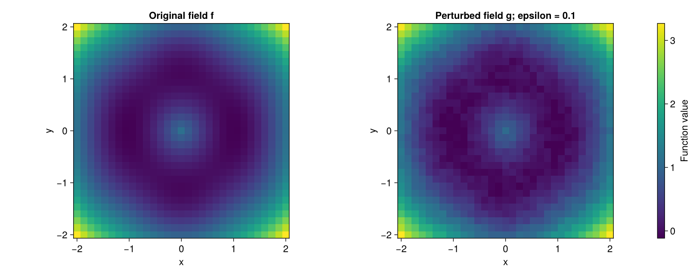
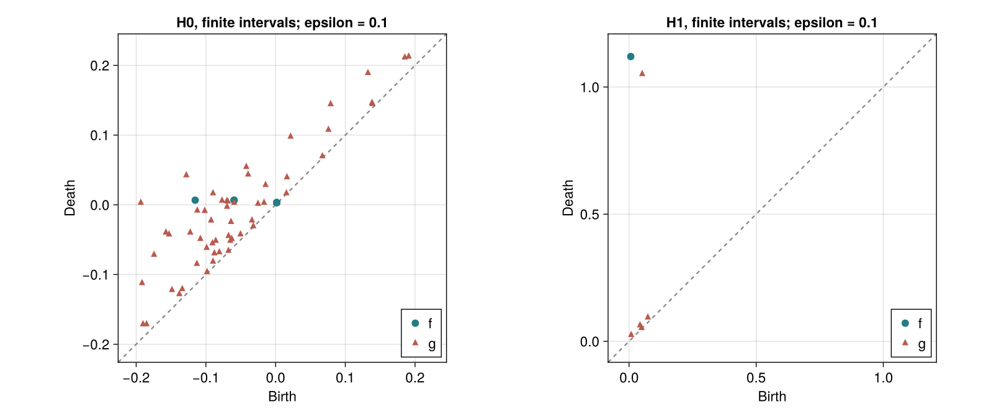
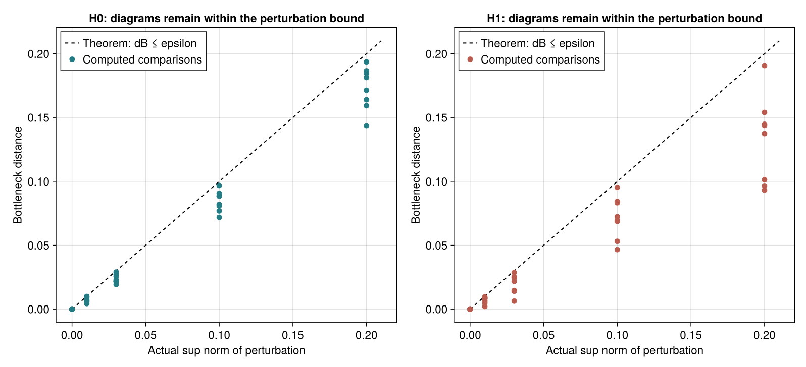

---
execute:
  enabled: false
---

# Cohen-Steiner et al. (2007): persistence stability

How much can a persistence diagram change when its input function changes? Cohen-Steiner, Edelsbrunner and Harer's [*Stability of Persistence Diagrams*](https://doi.org/10.1007/s00454-006-1276-5) gives a precise bound. Here we check that bound numerically with the local `TDARipserer` and `TDAPersistenceDiagrams` packages.

::: {.callout-note}
This is a **computational verification of a theorem on a new synthetic example**. The paper's central result is a proof; it does not supply an empirical benchmark for this experiment. We neither reproduce an original figure nor replace the proof with numerical evidence.
:::

The [author-hosted PDF](https://pub.ista.ac.at/~edels/Papers/2007-01-StabilityPersistenceDiagrams.pdf) is the earlier SoCG 2005 conference version, despite its filename. The citation above identifies the 2007 journal article. Both identify the same bottleneck stability inequality.

## The target

For continuous tame functions on a fixed triangulable domain, the stability theorem bounds diagram distance by function distance:

$$
d_B(D_k(f),D_k(g))\leq\lVert f-g\rVert_\infty.
$$

The bottleneck metric matches diagram points to each other or to the diagonal and minimizes the largest matching cost. A finite interval of lifetime $\ell$ can disappear into the diagonal at cost $\ell/2$. Matching points by their order in an exported CSV would not compute this metric.

We use coefficients in $\mathbb F_2$, as in the conference paper. Our domain is a fixed finite square grid, and our input is a vertex-valued cubical filtration. Every cell enters at the maximum value of its incident vertices. If corresponding vertex values differ by at most $\epsilon$, corresponding cell values also differ by at most $\epsilon$. Consequently $K_f(t)\subseteq K_g(t+\epsilon)$ and $K_g(t)\subseteq K_f(t+\epsilon)$ for every level $t$. These inclusions give the filtration bound on the domain actually computed.

The norm below is measured on those **961 vertices**, not estimated for an unsampled continuous surface. Changing the grid, the boundary conditions or the domain would require a different comparison.

## Generate the data

There is no external observational dataset for this target. The parameters are stored in [config.toml](experiments/stability2007/config.toml), and [run.jl](experiments/stability2007/run.jl) implements the generator. The exported field and noise arrays make the numerical inputs inspectable.

| Choice | Value |
|:--|:--|
| Grid | $31\times31$ vertices on $[-2,2]^2$ |
| Base values | $(\sqrt{x^2+y^2}-1)^2+0.12\cos(3x)\cos(2y)$ |
| Perturbation amplitudes | $0,0.01,0.03,0.10,0.20$ |
| Random seeds | 2007 through 2014 |
| Noise | Independent uniform draws, rescaled to maximum absolute value one |
| Homology | $H_0,H_1$ over $\mathbb F_2$ |
| Filtration | Complete cubical filtration; no persistence cutoff |
| Numerical tolerance | $10^{-10}$ for the inequality check |

The radial term produces a low ring around a higher center. The cosine term creates additional local variation. These are our choices for exercising both connected-component and hole persistence.

```julia
using TDARipserer, TDAPersistenceDiagrams, Random

grid = range(-2.0, 2.0; length=31)
f = [(hypot(x,y)-1)^2 + 0.12cos(3x)*cos(2y)
     for x in grid, y in grid]

rng = MersenneTwister(2007)
noise = 2rand(rng, size(f)...).-1
noise ./= maximum(abs, noise)
g = f .+ 0.10 .* noise
epsilon = maximum(abs, g.-f)
```

{#fig-stability-fields}

## Compute and compare the diagrams

Both arrays use the same cubical domain and full filtration. We compare each homology dimension separately:

```julia
Df = ripserer(Cubical(f); dim_max=1, modulus=2)
Dg = ripserer(Cubical(g); dim_max=1, modulus=2)

distances = [Bottleneck()(Df[k], Dg[k]) for k in 1:2]
all(distances .<= epsilon + 1e-10)
```

Ordinary $H_0$ has one essential interval because the final square is connected. Its death is infinite. We retain it in the metric calculation; its birth is the minimum vertex value and must also satisfy the perturbation bound. Dropping all infinite intervals would remove a useful check.

{#fig-stability-diagrams}

## Numerical results and an independent sanity case

The experiment makes 80 comparisons: eight noise realizations, five amplitudes and two homology dimensions. The exported [comparison table](experiments/stability2007/results/perturbations.csv) records the actual norm, bottleneck distance, interval counts and slack for every comparison. [summary.toml](experiments/stability2007/results/summary.toml) records the aggregate checks.

**All 80 comparisons satisfy the bound**, with zero positive excess even before applying the tolerance. All zero-perturbation and self-distance checks return zero. The base field has eight $H_0$ intervals, including its essential interval, and one $H_1$ interval.

| Dimension | Comparisons | Largest observed bottleneck distance | Violations |
|:--|--:|--:|--:|
| $H_0$ | 40 | 0.193608279 | 0 |
| $H_1$ | 40 | 0.190719987 | 0 |

Both maxima occur at amplitude $0.2$. These maxima are observations for the chosen fields; they are not universal constants.

{#fig-stability-bound}

We also add the constant $c=0.1$ to every vertex. This translates every birth and finite death by $c$, while essential deaths remain infinite. The script checks those endpoints independently of the inequality. In $H_0$, the essential interval forces the bottleneck distance to equal $c$: it cannot match the diagonal, and there is only one essential interval in each diagram. This checks a case where the bound is attained, rather than only observing distances below it.

The [translation table](experiments/stability2007/results/translation.csv) and complete exported diagrams retain that check. The executable test set also checks zero perturbations, self-distance, the essential interval's birth and the translation of every endpoint.

The measured translation distances are $0.1$ in $H_0$ and $0.10000000000000009$ in $H_1$, agreeing with the expected value to floating-point precision. All 14 executable assertions pass.

## Re-run the experiment

Run these commands from the JuliaTDA workspace root:

```sh
julia --startup-file=no TDA_with_julia/reproductions/experiments/stability2007/setup.jl
julia --startup-file=no --project=TDA_with_julia/reproductions/experiments/stability2007 TDA_with_julia/reproductions/experiments/stability2007/run.jl
julia --startup-file=no TDA_with_julia/reproductions/experiments/stability2007/provenance.jl
```

Setup modifies only this experiment's environment. It develops the two component packages from the sibling directories in this workspace; the analysis uses no network. Julia 1.12.5 was used for the saved outputs. [environment.lock.toml](experiments/stability2007/environment.lock.toml) records the resolved dependency versions with relative local paths. To restore it, copy it to `Manifest.toml` in the experiment directory and instantiate that environment instead of resolving a new one. The local package source hashes are recorded in [provenance.toml](experiments/stability2007/results/provenance.toml).

The book embeds precomputed figures and displays static Julia examples. Rendering this chapter does not regenerate the experiment. The complete [run.jl](experiments/stability2007/run.jl) regenerates the CSV files, figures and assertions.

## What this establishes

This checks the local cubical-persistence and bottleneck implementations against a mathematical constraint, including essential intervals and a case with a known exact distance. It does not test every filtration or every diagram, prove the theorem, or measure convergence to the continuous surface as the grid is refined. The theorem bounds the largest matching cost; it does not promise that the number of short intervals remains fixed under perturbation.
