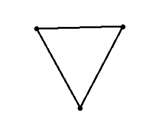

# Simplicial complexes

> "Are you a man, Octave? Do you see the leaves falling from the trees, the sun rising and setting? Do you hear the ticking of the horologe of time with each pulsation of your heart? Is there, then, such a difference between the love of a year and the love of an hour? I challenge you to answer that, you fool, as you sit there looking out at the infinite through a window not larger than your hand." \
> --- Alfred de Musset, in "The confession of a child of the century"

## The infinite through a window

Topological spaces are nice, but all the interesting ones have an infinite amount of points: torus, circle, the real line, mobius band, projective plane, and so on. Topology usually is not interested in finite sets because their standard topology is trivial: just take every point as an open set.

We, as humans, can't really grasp the infinite. Our universe is finite, and so is our mind. To think about the infinite, we need to use finite "tricks". Take, for example, the way we prove something is valid for all the infinite natural numbers, a principle called [finite induction](https://en.wikipedia.org/wiki/Mathematical_induction):

- first prove that a certain property $P$ is true for 1;
- then, prove that if it is valid for $n$, then it is also valid for $n+1$.

Peano [needed an axiom](https://en.wikipedia.org/wiki/Peano_axioms) to guarantee that these 2 conditions are enough to prove that $P$ is valid for all $\mathbb{N}$.

![The finite induction principle can be tought of as a domino falling and pushing the next piece. But with infinite domino pieces and infinite patience. Source: Wikipedia^[https://commons.wikimedia.org/wiki/File:Dominoeffect.png]](images/Dominoeffect.png)

As another example, when studying linear algebra we see the concept of [basis](https://en.wikipedia.org/wiki/Basis_(linear_algebra)) of a vector space $V$. With basis, we can describe exactly any point $v \in V$ using a finite combination of its base elements, say $v = \lambda_1 e_1 + \ldots \lambda_n e_n$. The infinite amount of points in $V$ can then be written as sums of finite objects that we can map mentally.

Finding a finite representation of a mathematical object is often desired, and with topological spaces it was not different.

## Graphs

Graphs were created by Euler in 1736 because he wanted to visit Königsberg but was too lazy^[The original text is in Latin, so I just invented this.] to walk around like a normal person, and then tried to [cross all its bridges just one time](https://en.wikipedia.org/wiki/Seven_Bridges_of_K%C3%B6nigsberg).

![Can you walk through the city crossing each of those bridges once and only once? Spoiler: no, you can't. Stop trying! Source: Wikipedia^[https://en.wikipedia.org/wiki/File:Konigsberg_bridges.png]](images/sc-bridge.png)

We can abstract away this map with its bridges and just think about the bridges and the portions of land: 

![The map of Königsberg if the city was a green carpet. Source: Wikipedia^[https://en.wikipedia.org/wiki/File:7_bridges.svg]](images/sc-bridges2.png)

Euler did even better! He needed just two things to represent this object:

- points: the portions of the cities;
- edges: bridges that connect two points.

The result is the following:

]](images/sc-bridges3.png)

Oops, Euler just invented [graphs](https://en.wikipedia.org/wiki/Graph_(discrete_mathematics))!

Formally,

:::{#def-graphs}
A *directed graph* is a pair $G = (V, E)$ where $V$ is a set called *vertices* and $E \subseteq V \times V$ is a set of *edges* between the vertices. An element $(v, w) \in E$ can also be represented as $v \to w$. 

An *undirected graph* is defined similarly, but edges are unordered pairs $\{v, w\}$ instead of ordered pairs $(v, w)$. In an undirected graph, there is no distinction between "from $v$ to $w$" and "from $w$ to $v$" — the edge simply connects the two vertices. Unless stated otherwise, **graphs in this book are undirected**.
:::

He noticed that when you travel to a green point $v$, you need to take another bridge to get out of $v$. Thus, the number of edges need to be *even* for all the points we visit during the middle of our journey (excluding the beginning and the end). But all points in the above graph have an odd number of edges! Therefore, it is impossible to travel cross each bridge just once and still visit all the green points.

Graphs can be used whenever we need to represent a set of objects and a pairwise relation between these objects.

### The essence of a circle

What is a circle, really? The boring answer is "the set of points that dist $r$ of a point $p$". But in a topological view, a circle is just a 1-dimensional closed real interval with its extremities glued together, forming a hole inside.

The following graph, when seen as a subset of $\mathbb{R}^2$ is homeomorphic to a circle:

{#fig-}

With this horrendous graph^[See [https://en.wikipedia.org/wiki/Monster_group]() for more terror tales in mathematics.] we can represent a circle in a finite way: three points $a, b, c$ and all possible edges: $a \to b$, $b \to c$, $c \to a$.

## Simplicial complexes

Why stop with vertices and edges? Edges are just pairs of edges. Why not take triples and quadruples and so on?

Well, now you've reinvented [simplicial complexes](https://en.wikipedia.org/wiki/Simplicial_complex)! Congratulations!

:::{#def-}
A simplicial complex $\Sigma$ is a set of subsets of $X$ with the following property:

- for any $\sigma \in \Sigma$, every subset of $\sigma$ (also called *a face* of $\sigma$) is also in $\Sigma$;
- given non-empty $\sigma_1, \sigma_2 \in \Sigma$, the intersection $\sigma_1 \cap \sigma_2$ is also in $\Sigma$.
:::

## From data to simplicial complexes {#sec-data-to-sc}

So far, simplicial complexes are abstract mathematical objects. But why should we care? Because they give us a way to build topology from data!

Suppose we have a finite set of points $X = \{x_1, \ldots, x_n\}$ in some metric space (for example, $\mathbb{R}^d$ with the Euclidean distance). We can build a simplicial complex from $X$ by declaring that points that are "close enough" form simplices. There are several ways to do this:

### Vietoris-Rips complex

Fix a parameter $\epsilon > 0$. The *Vietoris-Rips complex* $\text{VR}(X, \epsilon)$ is the simplicial complex where a subset $\sigma = \{x_{i_0}, \ldots, x_{i_k}\} \subseteq X$ is a simplex if and only if 

$$
d(x_{i_j}, x_{i_l}) \leq \epsilon \quad \text{for all } j, l.
$$

In words: a set of points forms a simplex if every pair of points in the set is within distance $\epsilon$.

### Čech complex

Fix $\epsilon > 0$. The *Čech complex* $\check{C}(X, \epsilon)$ is the simplicial complex where $\sigma = \{x_{i_0}, \ldots, x_{i_k}\}$ is a simplex if and only if the balls $B(x_{i_j}, \epsilon/2)$ have a common intersection:

$$
\bigcap_{j=0}^{k} B(x_{i_j}, \epsilon/2) \neq \emptyset.
$$

The Čech complex has a beautiful theoretical property: by the [Nerve Theorem](https://en.wikipedia.org/wiki/Nerve_of_a_covering#Nerve_theorem), it is homotopy equivalent to the union of balls $\bigcup_i B(x_i, \epsilon/2)$. However, it is more expensive to compute than the Vietoris-Rips complex, so in practice Rips complexes are used more often.

### The role of $\epsilon$

The choice of $\epsilon$ is crucial. Too small, and the complex is just a collection of isolated points (no edges, no triangles). Too large, and everything is connected into a single giant simplex that hides all interesting structure. 

This is a fundamental problem: **there is no single "correct" $\epsilon$**. The solution? Don't choose one — examine all of them! This idea leads to *persistent homology*, which we will explore in a later chapter.

## Abstract vs geometric simplicial complexes

In our definition above, a simplicial complex is defined purely in terms of sets and subsets — there is no mention of geometry or coordinates. This is called an *abstract* simplicial complex.

However, every abstract simplicial complex can be "realized" as a geometric object: a $k$-simplex can be embedded in $\mathbb{R}^{k}$ as the convex hull of $k+1$ points in general position. More precisely,

::: {#def-}
The *standard $k$-simplex* is the convex hull of the $k+1$ standard basis vectors $e_0, e_1, \ldots, e_k$ in $\mathbb{R}^{k+1}$:

$$
\Delta^k = \left\{ \sum_{i=0}^{k} t_i e_i \;\middle|\; t_i \geq 0, \sum_{i=0}^{k} t_i = 1 \right\}.
$$
:::

For example, $\Delta^0$ is a point, $\Delta^1$ is a line segment, $\Delta^2$ is a triangle (with its interior), and $\Delta^3$ is a tetrahedron.

Any abstract simplicial complex with $n$ vertices can be geometrically realized in $\mathbb{R}^{2n+1}$ (this is a theorem!). The practical consequence is that we can think of simplicial complexes both as combinatorial objects (lists of subsets) and as geometric shapes — whichever is more convenient for the task at hand.

We will use the combinatorial view when computing homology and the geometric view when building intuition.

