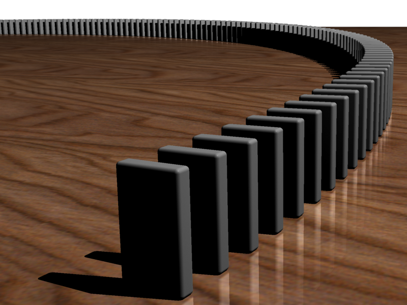
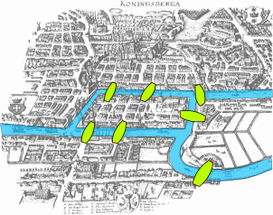
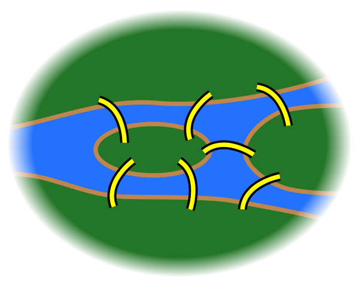
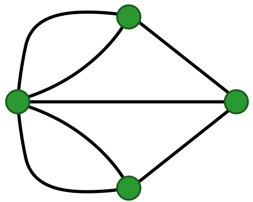

# Simplicial complexes {#sec-simplicial-complexes}

> "Do you see the leaves falling from the trees, the sun rising and setting?" \
> --- Alfred de Musset, in *The Confession of a Child of the Century*

## The infinite through a window

A circle, a torus, and the real line contain infinitely many points. A computer has a finite amount of memory, and so do I. We need a finite description that still remembers something about the shape.

As @sec-square-topology showed, a finite metric point cloud has a discrete topology. Just storing a list of points gives us no loops. This does not make every finite topological space uninteresting—non-discrete finite topologies exist—but it explains why a list of measurements needs another construction.

Mathematics often handles the infinite with finite descriptions. Induction uses a starting case and a rule for the next case. A finite-dimensional vector space uses a finite basis to describe infinitely many vectors. Simplicial complexes offer a similar bargain: finitely many building blocks can describe a space with infinitely many points.

## Graphs

Euler studied the bridges of Königsberg in 1736 because he wanted to visit the city but was too lazy^[I invented the laziness. The bridge problem is real.] to walk around like a normal person. Could he cross each bridge exactly once?

Forget the geography for a moment. Represent each land region by a vertex and each bridge by an edge:

An edge records a pairwise relation. The bridge example is a *multigraph*, because two land regions can have more than one bridge between them. Most graphs in this book are simpler:

::: {#def-graphs}
A *simple undirected graph* is a pair $G=(V,E)$, with vertex set $V$ and edges that are two-element subsets $\{v,w\}\subseteq V$. There are no repeated edges or edges from a vertex to itself.

A *directed graph* instead uses ordered pairs $(v,w)$, often written $v\to w$. Unless stated otherwise, our graphs are undirected.
:::

At every intermediate stop on a bridge-crossing walk, an arrival must pair with a departure. Thus at most two vertices—the start and the finish—can have odd degree. All four land regions in the Königsberg graph have odd degree, so the proposed walk is impossible. A finite description has answered the question without making Euler wear out his shoes.

### The essence of a circle

A geometric circle is the set of points a fixed distance from a center. Topologically, it is also what we get by joining the ends of an interval.

{#fig-simplicial-circle}

The drawing has three vertices and three edges. The **geometric realization** of this graph includes every point along the edges, not just the three vertices; it is homeomorphic to a circle. There is no filled triangular face. That missing face will become very important.

## Simplices and their faces

Why stop with vertices and edges? An edge uses two vertices; three can specify a filled triangle, four a filled tetrahedron, and so on. Congratulations, you have reinvented simplicial complexes!

::: {#def-abstract-simplicial-complex}
A finite *abstract simplicial complex* $K$ on a vertex set $V$ is a collection of subsets of $V$ such that every subset of a member of $K$ also belongs to $K$.

A nonempty member $\sigma\in K$ is a *simplex*. If $\sigma$ has $k+1$ vertices, its dimension is $k$. Its subsets are its *faces*. We include the empty face by convention, but do not count it when computing ordinary homology.
:::

Thus a $0$-simplex is a vertex, a $1$-simplex an edge, a $2$-simplex a filled triangle, and a $3$-simplex a filled tetrahedron. Including $\{a,b,c\}$ requires including its three edges and three vertices. The converse fails: having all three edges does not force an abstract complex to contain the triangle.

The intersection of two simplices is automatically a face of both. This follows from closure under subsets; we do not need a second axiom for the abstract definition.

## Abstract objects, geometric spaces {#sec-geometric-realization}

The definition is a list of subsets; it says nothing about coordinates. To turn this list into a space, realize each simplex as a solid geometric simplex and glue matching faces.

For $n$ vertices, there is a convenient construction in $\mathbb R^n$. Assign vertex $i$ the standard basis vector $e_i$. For every $\sigma\in K$, take the convex hull of its assigned vertices. Their union is the *geometric realization*, written $|K|$:

$$
|K|=\left\{\sum_{i=1}^n t_i e_i\ \middle|\ t_i\geq0,\ \sum_i t_i=1,
\ \{i:t_i>0\}\in K\right\}.
$$

A simplex has only finitely many vertices, but its geometric realization has infinitely many points. There is our window onto the infinite.

We can often draw the same realization in a smaller ambient space. However, the coordinates of the original data need not realize the abstract complex faithfully. Four coplanar square corners cannot be the vertices of a nondegenerate tetrahedron! When the Rips construction below includes a $3$-simplex, it means an abstract tetrahedron; it does not suddenly lift one of our measured points off the table.

We use the combinatorial view for computation and the geometric view for intuition. Results about the topology of a complex refer to its realization [@hatcher2002].

## From data to simplicial complexes {#sec-data-to-sc}

Let $X=\{x_1,\ldots,x_n\}$ be a finite set in a metric space. Distances tell us which vertices are near one another. A scale parameter turns that information into simplices.

### Vietoris–Rips complex {#sec-rips-definition}

::: {#def-vietoris-rips}
For $\epsilon\geq0$, the *Vietoris–Rips complex* $\mathrm{VR}(X,\epsilon)$ consists of the subsets $\sigma\subseteq X$ such that

$$
d(x,x')\leq\epsilon\qquad\text{for every }x,x'\in\sigma.
$$
:::

We use the **diameter convention**: $\epsilon$ is the largest allowed pairwise distance, not a ball radius. Some references use a different factor of two, so always check the convention before comparing scales.

First build a graph linking points at distance at most $\epsilon$. Then fill every clique: three mutually linked vertices give a triangle, four give a tetrahedron, and so on. This automatically includes all faces. Notice the difference from the graph in @fig-simplicial-circle: in a Rips complex, a complete three-vertex graph comes with its filling.

### Čech complex

Fix an ambient metric space containing $X$, and place a **closed** ball of radius $\epsilon/2$ at each data point. The *Čech complex* contains $\sigma$ when those balls have a common intersection:

$$
\bigcap_{x\in\sigma}\overline B(x,\epsilon/2)\neq\emptyset.
$$

The ambient space matters: an intersection in $\mathbb R^2$ is different from an intersection restricted to the finite set $X$.

In Euclidean space, these balls and their nonempty intersections are convex, hence contractible. The nerve theorem for a finite family of convex sets implies that the Čech realization has the homotopy type of their union [@edelsbrunner2010]. “Same homotopy type” is weaker than “homeomorphic,” but it is enough to preserve homology.

The corresponding general theorem uses a *good cover*: nonempty finite intersections must be contractible, together with appropriate cover hypotheses, such as a finite open cover. Balls in an arbitrary metric space do not automatically satisfy this condition. The Čech definition still makes sense there; the Euclidean conclusion does not follow merely because we named the sets balls.

Rips needs only pairwise distances; Čech requires testing common intersections. This helps explain why Rips is convenient for general data, while Čech and its Euclidean relatives offer a closer connection to unions of balls. We revisit the computational choices in [Computing persistent homology](computing_ph.qmd).

## Our square at three scales {#sec-square-complexes}

Label the square corners in cyclic order as in @sec-square-topology. Their Euclidean distance matrix is

$$
D=\begin{array}{c|cccc}
 &a&b&c&d\\\hline
a&0&1&\sqrt2&1\\
b&1&0&1&\sqrt2\\
c&\sqrt2&1&0&1\\
d&1&\sqrt2&1&0
\end{array}.
$$

The sides have length $1$; the diagonals have length $\sqrt2$. We can therefore list every change in the Rips complex without guessing:

| Scale | Simplices present | Shape of the realization |
|---|---|---|
| $0\leq\epsilon<1$ | Four vertices | Four isolated points |
| $1\leq\epsilon<\sqrt2$ | Vertices and the four side edges | One square loop |
| $\epsilon\geq\sqrt2$ | All subsets of the four vertices | A filled tetrahedron |

At the middle scale there are no triangles: every three square vertices include a pair separated by a diagonal. At the last scale, both diagonals, all four triangles, and the tetrahedron enter together. It is a full $3$-simplex, rather than just a square with its planar interior colored in.

A tetrahedron's **surface** would include its four triangular faces but omit its $3$-simplex. That surface encloses a cavity; the full tetrahedron does not. Listing simplices carefully saves us from letting a drawing invent a hole.

## The role of scale

A small scale leaves isolated points. A sufficiently large scale turns a finite metric space into one full simplex. Neither extreme usually describes the structure we hoped to study.

There need not be a single best scale. Persistent homology will track the changes across scales rather than requiring us to choose one at the start. We will still need to choose a metric, preprocessing, and a computational limit; persistence does not make those choices disappear. The [uncertainty chapter](uncertainty.qmd) explains how to examine their consequences.

## Stop and predict

1. At $\epsilon=1.2$, does our square Rips complex contain $\{a,b,c\}$? Does it contain $\{a,b\}$?

::: {.callout-note collapse="true" title="Answer: check every pair"}
It contains $\{a,b\}$ because $d(a,b)=1\leq1.2$. It does not contain $\{a,b,c\}$ because $d(a,c)=\sqrt2>1.2$. One missing edge is enough to exclude a simplex.
:::

2. Three points form an equilateral triangle of side length $1$. Does their Rips filtration ever contain an unfilled triangular loop for a positive range of scales?

::: {.callout-note collapse="true" title="Answer: edges and filling enter together"}
No. Below $1$, there are only vertices. At $1$, all three edges and the $2$-simplex enter together. A hand-drawn triangular graph has a loop, but its Rips completion fills that loop immediately. Any interval from an artificial ordering within this tied scale has zero length.
:::

3. What must you omit from a full tetrahedron to leave a hollow sphere? May you instead omit one edge but retain every triangular face?

::: {.callout-note collapse="true" title="Answer: faces must remain consistent"}
Omit the $3$-simplex and keep its four faces, edges, and vertices. The realization is the tetrahedron's surface, homeomorphic to a sphere. Keeping a triangle while deleting one of its edges violates closure under faces, so it would not be a simplicial complex.
:::
