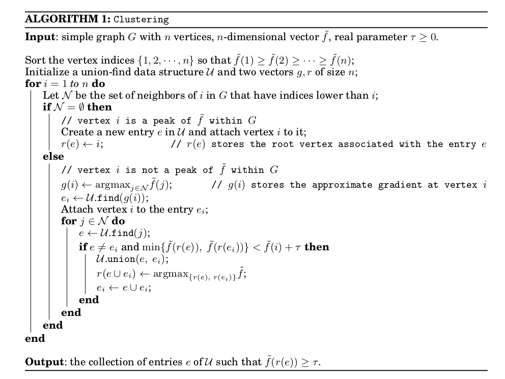

# ToMATo

Given a point cloud $X$, how can topology help us discover clusters?

The ToMATo algorithm combines three ingredients:

- a metric space;
- a density function on that space;
- a proximity graph telling us which points count as neighbors.

Once those ingredients are in place, ToMATo climbs the density landscape, tracks how peaks merge, and uses persistence to decide which peaks are real clusters and which are just noise.

One good way to understand ToMATo is to pretend we are inventing it from scratch. We will start with a toy point cloud, turn it into a landscape, and then ask how to follow that landscape toward stable peaks.

## Setup

```{julia}
using CairoMakie
using MetricSpaces
using TDAplots
using ToMATo
using Random
```

## A point cloud with three peaks

We start with a synthetic dataset containing two large clusters and one smaller one:

```{julia}
rng = MersenneTwister(0)
X = EuclideanSpace(
    hcat(
        randn(rng, 2, 800),
        0.8 .* randn(rng, 2, 800) .+ [4.0, -4.0],
        0.3 .* randn(rng, 2, 100) .+ [-2.0, 2.0],
    ),
)
Xmat = as_matrix(X)

fig = Figure()
ax = Axis(fig[1, 1], title = "Three noisy clusters", aspect = DataAspect())
scatter!(ax, Xmat[1, :], Xmat[2, :], markersize = 4)
fig
```

We can already guess that there are three dense regions, but ToMATo will make that intuition precise.

## Density

The local JuliaTDA stack provides a kernel density estimator in `MetricSpaces.jl`:

```{julia}
ds = kde(X, bandwidth = 0.5)

fig = Figure(size = (800, 400))
ax1 = Axis(fig[1, 1], title = "Point cloud", aspect = DataAspect())
scatter!(ax1, Xmat[1, :], Xmat[2, :], markersize = 4)

ax2 = Axis(fig[1, 2], title = "Colored by density", aspect = DataAspect())
scatter!(ax2, Xmat[1, :], Xmat[2, :], color = ds, markersize = 4)
fig
```

The corresponding density landscape looks like a collection of mountains:

```{julia}
fig = Figure()
ax = Axis3(fig[1, 1], title = "Density landscape")
scatter!(ax, Xmat[1, :], Xmat[2, :], ds, color = ds, markersize = 4)
fig
```

Informally, points near the top of a mountain are local density maxima. Those are the candidate cluster centers.

Conceptually, the density of a point is obtained by averaging a kernel over its distances to the rest of the dataset:

$$
\mathrm{dens}(x) = \frac{1}{|X|} \sum_{y \in X} K\!\left(\frac{d(x,y)}{h}\right),
$$

where $h$ is the bandwidth. Larger bandwidths smooth the landscape; smaller ones reveal finer local bumps.

## The proximity graph

ToMATo does not work directly with all pairwise distances. Instead, it builds a graph whose vertices are the points of $X$ and whose edges connect nearby points:

```{julia}
g = proximity_graph(X, 0.5; min_k_ball = 4, max_k_ball = 6, k_nn = 3)

tomato_graph_plot(X, g, ds)
```

This graph is built point-by-point:

- first try to connect a point to the points in its $\epsilon$-ball;
- if that ball is too small, fall back to a fixed number of nearest neighbors;
- if the ball is too large, cap the number of edges.

Those three parameters control how local or global the resulting notion of neighborhood becomes.

At this point we can imagine a mountain-climbing algorithm:

- if a point is already at a local maximum, it should seed a cluster;
- otherwise, it should inherit the cluster of a higher-density neighbor.

That is the core idea behind ToMATo.

## Too many peaks

If we run ToMATo with $\tau = 0$, then every little bump in the density can survive as its own cluster:

```{julia}
clusters_raw, _ = tomato(X, g, ds, 0.0)

tomato_graph_plot(X, g, float.(clusters_raw))
```

This usually over-segments the data. Every tiny bump in the density can survive as its own cluster, even when it is obviously just a wrinkle on the side of a larger mountain.

## Merging insignificant peaks

ToMATo fixes that by merging peaks whose lifetimes are too short. The parameter $\tau$ sets the persistence threshold:

```{julia}
τ = 0.01
clusters, _ = tomato(X, g, ds, τ, max_cluster_height = τ)

metricspace_plot(X, color = string.(clusters), markersize = 4)
```

Now we recover the three clusters we expected. Topologically, what survived was not every local maximum, but every maximum whose persistence was large enough to count as meaningful.

## Choosing $\tau$

The usual workflow is to run ToMATo once with $\tau = \infty$ and inspect the birth-death pairs of the peaks:

```{julia}
_, births_and_deaths = tomato(X, g, ds, Inf)

tomato_persistence_plot(births_and_deaths)
```

Points far from the horizontal axis correspond to peaks that survive for a long time. Those are the peaks worth keeping. Small points near the axis are short-lived peaks that can be merged away.

If we increase $\tau$ further, the small cluster eventually merges into one of the large ones:

```{julia}
τ = 0.04
clusters_merged, _ = tomato(X, g, ds, τ, max_cluster_height = τ)

metricspace_plot(X, color = string.(clusters_merged), markersize = 4)
```

There is no universal value of $\tau`. The persistence plot helps you pick one that matches the scale of the structure you care about. In practice, this is one of ToMATo's strengths: the algorithm tells you which peaks are stable before you commit to a final clustering.

## The original algorithm

Here is the original schematic description from [@tomato]:



## Summing up

ToMATo needs:

- a metric space $X$;
- a density function $f$ on $X$;
- a proximity graph $g$ on $X$;
- a persistence threshold $\tau$.

Different choices of density and neighborhood graph lead to different clustering behavior. In this chapter we used a Gaussian-style kernel density estimator and a mixed $\epsilon$-ball / k-nearest-neighbor graph, but other combinations are possible.

That flexibility is important: ToMATo is not just a single clustering rule, but a topological framework for combining geometry, density, and persistence.
