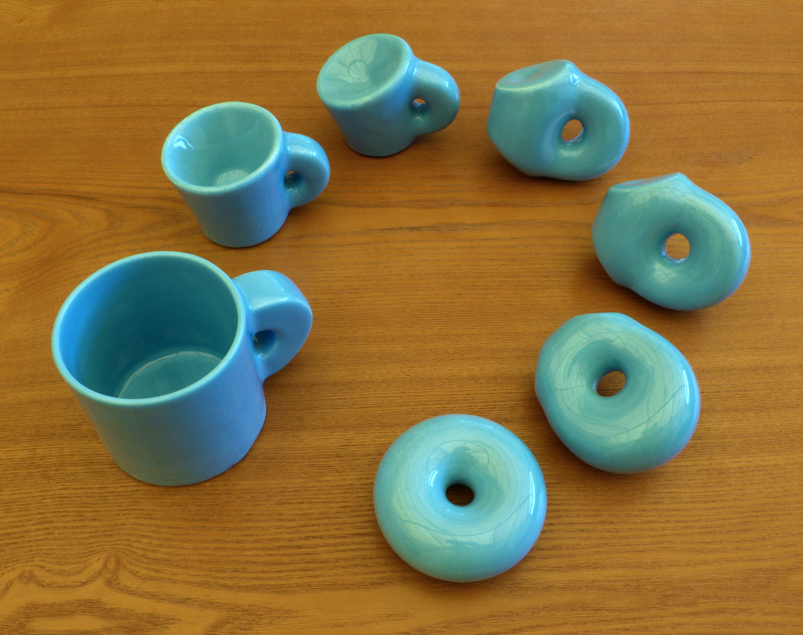
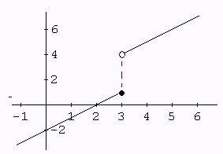

# Topology {#sec-topology}

> "New roads arise, but the old ones lead on. They do not become overgrown." \
> --- Stanisław Lem, in *Return from the Stars*

This chapter introduces topological spaces, continuity, and homeomorphisms. The definitions are abstract, but their job is concrete: say which properties survive when a shape is stretched without being torn apart.

## What is topology?

[Topology](https://en.wikipedia.org/wiki/Topology) is the study of topological spaces and their properties. Unfortunately, this is not enough to close this chapter.

A topology tells us which subsets of a space are *open*. Open sets describe neighborhoods: regions in which a point has some room around it. In the real line, open intervals play this role. The definition below lets us talk about neighborhoods even when we have no ruler with which to measure distance.

The familiar rubber-sheet picture is a useful intuition: stretch a shape, twist it, but do not tear it or glue distinct points together. This is the origin of the old joke that a topologist cannot distinguish a cup from a donut.

{width=100% #fig-topology-joke}

::: {#def-topological-space}
A *topological space* is a pair $(X,\tau)$, where $X$ is a set and $\tau$ is a collection of subsets of $X$ satisfying:

- $\emptyset$ and $X$ belong to $\tau$;
- an arbitrary union of sets in $\tau$ belongs to $\tau$;
- a finite intersection of sets in $\tau$ belongs to $\tau$.

The collection $\tau$ is a *topology* on $X$, and its members are the *open sets*.
:::

We often omit $\tau$ and simply write “a topological space $X$.” Sometimes we omit “topological,” too. We love omitting!

The set of all subsets of $X$ is called its *power set*, written $\mathcal P(X)$. A topology is therefore a particular collection $\tau\subseteq\mathcal P(X)$, not necessarily the whole power set.

Given a collection $S\subseteq\mathcal P(X)$, the *topology generated by $S$* is the smallest topology containing $S$. One construction takes arbitrary unions of finite intersections of members of $S$, including the empty intersection $X$ and the empty union $\emptyset$.

Don't let the abstractions hurt you! Whenever you see a new definition, think of an object that fits it.

::: {#exm-real-topology}
The usual topology on $\mathbb R$ is generated by the open intervals $(a,b)$. A subset $U\subseteq\mathbb R$ is open when, for every $x\in U$, there is some $\epsilon>0$ such that $(x-\epsilon,x+\epsilon)\subseteq U$.
:::

This makes precise the idea of being able to “walk a little more without leaving the set.” It does **not** mean that every open set is one connected piece: $(0,1)\cup(2,3)$ is open, too.

A space is *connected* if it cannot be partitioned into two nonempty disjoint open subsets. For a subset $A\subseteq X$, use its *subspace topology*: its open subsets are the intersections $A\cap U$ with $U$ open in $X$. Thus $(0,1)$ is connected, while $(0,1)\cup(2,3)$ is not.

## Continuity

In Calculus, we learn that a function $f:\mathbb R\to\mathbb R$ is continuous when we can draw its graph “without lifting the pencil from the paper.” Formalizing this notion took centuries and made many mathematicians go crazy.^[I just invented the last part. Maybe some of them really did, who knows?]

The pencil story is intuition for real functions, rather than a definition we can use for every topological space. The general definition uses neighborhoods:

::: {#def-continuous-map}
A function $f:(X,\tau)\to(Y,\sigma)$ is *continuous* if the inverse image of every open set of $Y$ is open in $X$:

$$
V\in\sigma\quad\Longrightarrow\quad f^{-1}(V)\in\tau.
$$

Here $f^{-1}(V)=\{x\in X:f(x)\in V\}$; no inverse function is required.
:::

For real functions, this is equivalent to the terrifying single line of first-year mathematics: at each $a\in\mathbb R$,

$$
\forall\epsilon>0,\ \exists\delta>0:\quad
|x-a|<\delta\ \Longrightarrow\ |f(x)-f(a)|<\epsilon.
$$

Every requested neighborhood of $f(a)$ has a sufficiently small neighborhood of $a$ that stays inside it after applying $f$. A jump fails this test: some neighborhood of the output excludes values reached arbitrarily close to the input.

## The notion of “sameness” in topology

Let's digress a little.

A topological space is specified by its points and its open sets. If we rename the points while preserving exactly which sets are open, every topological property survives. “Renaming” means a bijection $f:X\to Y$ such that $U\subseteq X$ is open if and only if $f(U)\subseteq Y$ is open.

::: {#def-homeomorphism}
Spaces $X$ and $Y$ are *homeomorphic*, written $X\approx Y$, if there is a continuous bijection $f:X\to Y$ whose inverse function is also continuous. Such a map is a *homeomorphism*.
:::

A continuous bijection alone is not enough in general: we need continuity in both directions. Rubber-sheet deformation helps us imagine many homeomorphisms, but the formal definition concerns the spaces themselves; it does not require a particular physical deformation through the surrounding space.

The relation $\approx$ is reflexive, symmetric, and transitive. We can therefore treat homeomorphic spaces as the same topological shape.

::: {#exm-interval-homeomorphism}
Every bounded open interval $(a,b)$ is homeomorphic to $\mathbb R$. First rescale it linearly to $(-\pi/2,\pi/2)$, then use the tangent function. Its inverse, arctangent followed by the inverse rescaling, is continuous as well.
:::

## Four points are not yet a square {#sec-square-topology}

Our running example will be the four corners of a unit square:

$$
a=(0,0),\quad b=(1,0),\quad c=(1,1),\quad d=(0,1).
$$

The set $X=\{a,b,c,d\}$ contains **four points**. It contains no edges and no filled interior. If you already see a loop, your imagination has kindly supplied the missing material.

Every finite metric space has the *discrete topology*: every subset is open. To see why, choose a ball around any point smaller than its distance to every other point. That ball contains only the chosen point, so all singletons are open; every subset is a union of singletons.

Consequently, the four square corners and four points in a straight line are homeomorphic as finite metric spaces with their induced topologies. Any bijection works! Their topology alone has forgotten their different distances.

TDA uses those distances to **build new spaces**. In the next chapter we will join nearby points with edges, triangles, and higher-dimensional simplices. The resulting space can have a loop even though the original four-point set does not. Keep this distinction in mind: we analyze a construction from the data, and then ask what that construction tells us about the data.

## The opposite of sameness

Exhibiting a homeomorphism proves two spaces have the same topology. How can we prove that no such map exists? There can be infinitely many candidates; testing them one by one would be a terrible hobby.

Instead, find an *invariant*: something homeomorphisms must preserve. For example, a connected interval cannot be homeomorphic to two separated intervals because a homeomorphism preserves connectedness.

Homology, introduced in @sec-simplicial-homology, supplies algebraic invariants. It assigns a group or vector space $H_k(X)$ to each space and a map

$$
H_k(f):H_k(X)\longrightarrow H_k(Y)
$$

to each continuous map $f:X\to Y$. It preserves identity maps and compositions. This kind of assignment is called a *functor*—our first small dip into category theory.

A homeomorphism is sent to an algebraic isomorphism. Therefore,

$$
H_k(X)\not\cong H_k(Y)\quad\Longrightarrow\quad X\not\approx Y.
$$

The converse need not hold: an invariant can simplify so much that distinct shapes receive the same answer. A summary helps us distinguish some spaces; it does not remember everything.

## Stop and predict

1. Is $[0,1)$ open in the usual topology of $\mathbb R$? Is it open as a subset of the space $[0,1]$?

::: {.callout-note collapse="true" title="Answer: the surrounding space matters"}
It is not open in $\mathbb R$: no interval around $0$ stays inside $[0,1)$. It is open in the subspace $[0,1]$, because $[0,1)=[0,1]\cap(-1,1)$. “Open” always refers to a specified topology.
:::

2. A bijection sends the four square corners to four points on a line. Is it a homeomorphism? Does it necessarily preserve distances?

::: {.callout-note collapse="true" title="Answer: topology can forget geometry"}
It is a homeomorphism because both finite metric spaces are discrete. It need not preserve distances; such a bijection would have to be an *isometry*. TDA's metric constructions retain information that this discrete topology loses.
:::

3. A circle and a closed interval are both connected. Does that prove they are homeomorphic?

::: {.callout-note collapse="true" title="Answer: matching summaries are not a proof"}
No. Matching one invariant leaves the question open. Remove a middle point from the interval: what remains is disconnected. Removing any single point from a circle leaves a connected space. A homeomorphism would preserve this difference, so these two connected spaces are not homeomorphic.
:::
